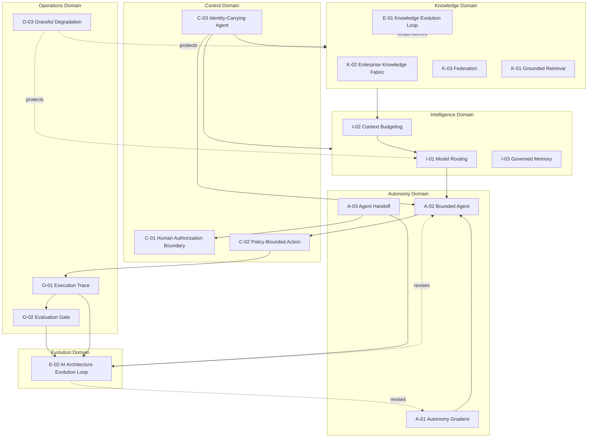

# RA-05 — Composite AI-Native Enterprise Architecture

## Scenario

RA-01 through RA-04 each compose a subset of this framework's patterns for a specific scenario — grounded retrieval, governed memory, bounded agency, observability. Real enterprise AI-native architectures, at maturity, run multiple such scenarios simultaneously against a shared foundation. RA-05 is that shared foundation: the complete, coherent composition of all 17 patterns across all six domains, showing how they relate as one system rather than four separate ones.

This is the architecture the meta-model in `framework/meta-model.md` describes abstractly, made concrete.

## When This Architecture Fits

- Organizations with multiple AI-native capabilities in production, where consistency and shared infrastructure across capabilities matters more than any single capability's implementation.
- As a target-state reference for organizations early in AI-native adoption, to understand what a coherent end-state looks like even if reached incrementally, capability by capability.

## When It Doesn't Fit

- A single, first AI-native capability with no near-term plan for a second — building toward this full composite before any capability is proven in production is premature; start with the narrower `RA-01`-`RA-04` scenario that matches the first capability's actual need, and let the composite emerge as capabilities accumulate.

## Architecture Overview

## Component Breakdown

Each of the six domains, and its role in the composite:

- **Knowledge** (`K-01`, `K-02`, `K-03`, `E-01`) — the governed substrate every capability's factual grounding depends on, kept current by a continuous evolution loop.
- **Intelligence** (`I-01`, `I-02`, `I-03`) — the reasoning layer: which model handles a request, what context it sees, and what it remembers across interactions.
- **Autonomy** (`A-01`, `A-02`, `A-03`) — how much independent action a given capability is permitted, explicitly assigned and scoped.
- **Control** (`C-01`, `C-02`, `C-03`) — the mechanisms that make autonomy defensible: human authorization boundaries, enforced policy, and attributable identity.
- **Operations** (`O-01`, `O-02`, `O-03`) — the observability, evaluation, and resilience backbone every other domain's behavior is measured through.
- **Evolution** (`E-01`, `E-02`) — the two feedback loops (knowledge-specific and architecture-wide) that keep the whole system from silently drifting out of date or out of coherence.

## Pattern Composition

| Domain | Patterns | Composite Role |
|---|---|---|
| Knowledge | `K-01`, `K-02`, `K-03`, `E-01` | Supplies grounded, current, federated facts to Intelligence and Autonomy layers. |
| Intelligence | `I-01`, `I-02`, `I-03` | Decides how a request is reasoned about, using Knowledge-domain input, budgeted and routed appropriately. |
| Autonomy | `A-01`, `A-02`, `A-03` | Determines how much of the Intelligence layer's output translates into independent action, and how a task moves between agents and humans. |
| Control | `C-01`, `C-02`, `C-03` | Makes every Autonomy-domain decision enforceable and attributable, not merely intended. |
| Operations | `O-01`, `O-02`, `O-03` | Observes and evaluates every other domain's actual behavior, and bounds the consequence of failure. |
| Evolution | `E-01`, `E-02` | Feeds Operations-domain signal back into deliberate change across Knowledge (`E-01`) and the full architecture (`E-02`). |

## Data / Control Flow

1. An identity-carrying request (`C-03`) enters the system.
2. The Knowledge domain resolves relevant, authorized, current information (`K-02`/`K-03`/`E-01`), traceable to source (`K-01`).
3. The Intelligence domain budgets and assembles context (`I-02`), incorporates relevant memory (`I-03`), and routes to the appropriate model (`I-01`).
4. The Autonomy domain determines what independent action, if any, the capability may take (`A-01`), scoped explicitly (`A-02`), with handoff to human or another agent when appropriate (`A-03`).
5. The Control domain enforces every proposed action against policy (`C-02`) and, where the autonomy level requires it, a human authorization boundary (`C-01`) — all attributed to the carried identity (`C-03`).
6. The Operations domain traces the entire execution (`O-01`), having gated any recent change to the capability through evaluation (`O-02`), and bounding any dependency failure to a signaled degradation (`O-03`).
7. The Evolution domain aggregates signal from Operations on a recurring cycle (`E-02`) and from Knowledge-source change continuously (`E-01`), feeding deliberate revisions back into every other domain.

## Integration Points and Seams

This composite is where the individually clean boundaries between RA-01 through RA-04 become genuinely interdependent: a change to an autonomy-level assignment (`A-01`, Autonomy domain) has direct consequences for what the Control domain must enforce (`C-02`) and what the Operations domain must observe more closely (`O-01`); a Knowledge-domain freshness failure (`E-01`) can be the root cause of an Operations-domain degradation event (`O-03`). Treating these as one system, with `E-02` as the mechanism that reconciles cross-domain signal, is what distinguishes this composite from four independently maintained reference architectures.

## Deployment Considerations

- No organization should attempt to deploy all 17 patterns simultaneously for a first AI-native capability — this composite is a target state reached incrementally, typically by first fully implementing one of `RA-01`-`RA-04` for an initial capability, then extending shared infrastructure (Knowledge fabric, Operations backbone) to subsequent capabilities.
- The Operations domain (`RA-04`) is the component most valuable to build as shared, cross-capability infrastructure early, since every other domain depends on it for the evolution loop to function.

## Security & Governance Considerations

- This composite is the level at which an organization's overall AI governance posture should be assessed — see `assessment/` for how the maturity model maps to this composite's domains.
- Every anti-pattern in `anti-patterns/` describes a specific way one domain's absence or degradation compromises the composite as a whole, not just the domain in isolation.

## Known Limitations and Open Trade-offs

- This composite describes architectural relationships, not an implementation sequence or project plan — `decision-framework/` and `labs/` provide the practical guidance for how an organization actually gets from a first capability to this composite over time.
- Full realization of the Evolution domain (`E-02` in particular) depends on sufficient operational history across multiple capabilities — a organization with only one or two capabilities in production will not yet have the aggregate signal this domain is designed to act on, and should expect this domain's value to compound as the capability portfolio grows.

## Vendor-Neutral Implementation Notes

No single vendor platform, as of this framework's August 2026 research pass, implements all six domains coherently out of the box — organizations should expect to compose this architecture from a mix of general-purpose infrastructure (identity providers, policy engines, observability platforms) and AI-specific tooling (model routers, retrieval/knowledge platforms, agent orchestration frameworks), unified by the governance and cross-domain discipline this framework describes rather than by a single product's feature set.

## Related Reference Architectures

`RA-01`, `RA-02`, `RA-03`, `RA-04` — each is a scenario-specific slice of this composite; this reference architecture is the whole they compose into.

## Revision History

- 0.1.0 (2026-08-24) — Initial reference architecture. Flagship composite completing the initial 5-reference-architecture set.
