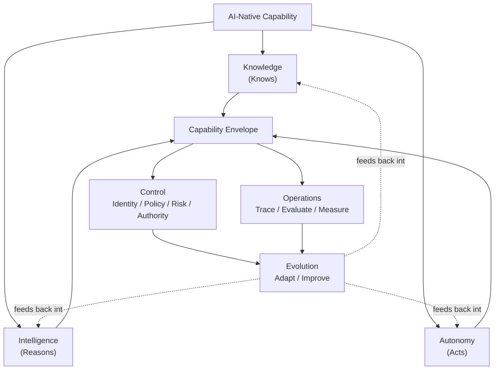

# Aqevon AI-Native Architecture Pattern Language

> *A vendor-neutral architecture language for systems that know, reason, act, operate under authority, and evolve.*

**Status: v0.1.0 (Research).** This repository is under active development. See [Research status](#research-status) below for what is stable versus still under prior-art review.

---

## What this repository is

This is the canonical source of truth for AQEVON's AI-Native Architecture research: a pattern language, reference-architecture library, decision framework, and assessment model for enterprises building systems that know, reason, and act — and that need those capabilities architected with authority, observability, and continuous evolution, not bolted on after the fact.

It is a **separate repository from the AQEVON corporate website**. This repository is the source/content layer; the website is a presentation and discovery layer that will eventually consume stable, tagged releases of this content (see [Versioning](#versioning)). PDFs, whitepapers, and eBooks are derived publication artifacts of this canonical Markdown/YAML content, never the reverse.

## Why AI-native architecture is different

Most enterprise architecture, software architecture, and cloud architecture disciplines were developed before "the system reasons about what to do next" was a routine design concern. TOGAF governs how architecture is developed and managed. Zachman organizes what must be represented. GoF and POSA solve recurring software design problems. Cloud provider patterns solve recurring distributed-systems problems. None of them are scoped to answer: *what does it mean for a system to know something, reason about it, and act on it — safely, observably, and in a way that can evolve as models, knowledge, and risk change underneath it?*

AQEVON exists to answer that specific question, as a complement to — not a replacement for — the disciplines above.

## The AQEVON meta-model

AI-native capability is organized into six domains, grouped into three functional pairs. Full detail: [`framework/meta-model.md`](framework/meta-model.md).



| Domain | Question it answers |
|---|---|
| **Knowledge** | What does the system know, and how governed is that knowledge? |
| **Intelligence** | How does the system reason — models, routing, context, memory? |
| **Autonomy** | How independently can the system act? |
| **Control** | What is the system authorized to do? |
| **Operations** | What is the system observed to actually do? |
| **Evolution** | How does the system change, deliberately, over time? |

## Flagship concepts

1. **[Enterprise Knowledge Fabric](framework/aqevon-ai-native-architecture.md#flagship-concept-1--enterprise-knowledge-fabric)** — a governed logical knowledge layer, not a vector database. See pattern `K-02` and reference architecture `RA-01`.
2. **[Autonomy Gradient](framework/aqevon-ai-native-architecture.md#flagship-concept-2--autonomy-gradient)** — a six-level scale (A0–A5) for how much independent action a capability should have. See pattern `A-01`.
3. **[AI Capability Envelope](framework/aqevon-ai-native-architecture.md#flagship-concept-3--ai-capability-envelope)** — Purpose, Knowledge, Reasoning, Tools, Authority, Action: the six facets every AI-native capability should be describable through.
4. **[AI Architecture Evolution Loop](framework/aqevon-ai-native-architecture.md#flagship-concept-4--ai-architecture-evolution-loop)** — Observe → Evaluate → Discover → Redesign → Validate → Deploy → Observe. See pattern `E-02`.

## Pattern catalog

17 patterns across the six domains. Every pattern uses the same [standard card structure](patterns/README.md) and carries a prior-art classification: **E**stablished, **S**ynthesized, or **P**roposed (see [`framework/terminology.md`](framework/terminology.md)).

| ID | Pattern | Domain | Classification (hypothesis) |
|---|---|---|---|
| K-01 | Grounded Retrieval | Knowledge | E |
| K-02 | Enterprise Knowledge Fabric | Knowledge | S/P |
| K-03 | Knowledge Federation | Knowledge | S |
| I-01 | Model Routing | Intelligence | E |
| I-02 | Context Budgeting | Intelligence | S/P |
| I-03 | Governed Memory | Intelligence | P |
| A-01 | Autonomy Gradient | Autonomy | P |
| A-02 | Bounded Agent | Autonomy | S |
| A-03 | Agent Handoff | Autonomy | E/S |
| C-01 | Human Authorization Boundary | Control | E/S |
| C-02 | Policy-Bounded Action | Control | S |
| C-03 | Identity-Carrying Agent | Control | P |
| O-01 | AI Execution Trace | Operations | S |
| O-02 | AI Evaluation Gate | Operations | S |
| O-03 | Graceful AI Degradation | Operations | S/P |
| E-01 | Knowledge Evolution Loop | Evolution | S/P |
| E-02 | AI Architecture Evolution Loop | Evolution | P |

Classifications are hypotheses pending full prior-art review — see [`research/prior-art-differentiation-matrix.md`](research/prior-art-differentiation-matrix.md) and the machine-readable [`patterns/index.yaml`](patterns/index.yaml).

Complementary: an [anti-pattern library](anti-patterns/README.md) of 8 recurring architectural mistakes (`AP-01`–`AP-08`).

## Reference architectures

Five vendor-neutral reference architectures, each with a technology-neutral core diagram plus Azure/AWS/GCP/open-source mapping guidance: `RA-01` Enterprise Knowledge Fabric, `RA-02` AI Control Plane, `RA-03` Agentic Enterprise, `RA-04` AI Evaluation & Operations, `RA-05` AI-Native Enterprise (the flagship composite architecture). See [`reference-architectures/`](reference-architectures/).

## Decision framework

Ten decision guides answering the questions architects actually face, built on one core principle: **complexity must be justified by capability.**

```
Deterministic workflow → Direct AI interaction → AI-assisted workflow → Single bounded agent → Multi-agent orchestration
```

AQEVON does not promote agentic architecture by default. See [`decision-framework/`](decision-framework/).

## Assessment

An AI-Native Architecture maturity model (Level 1 AI Assisted → Level 5 Adaptive AI Enterprise) across the six meta-model domains, designed as the foundation for a future AQEVON consulting assessment product. See [`assessment/`](assessment/).

## Architecture labs

Five hands-on labs working through realistic enterprise scenarios end-to-end — problem, starting architecture, target architecture, decision log, trade-offs, failure modes, pattern mapping, evaluation. See [`labs/`](labs/).

## Research status

| Category | Status |
|---|---|
| Meta-model (six domains) | Research — internally consistent, prior-art review in progress |
| Flagship concepts | Research — Enterprise Knowledge Fabric and Autonomy Gradient furthest along |
| Pattern catalog | Research — classifications are hypotheses pending validation |
| Anti-pattern library | Research |
| Reference architectures | Research |
| Decision framework | Research |
| Assessment model | Research / Beta — internal use, not yet a commercial product |
| Prior-art differentiation matrix | In progress — see `research/prior-art-differentiation-matrix.md` for current coverage and explicit "Evidence required" markers |

See [`GOVERNANCE.md`](GOVERNANCE.md) for the full pattern lifecycle definition.

## How to use this repository

- **Architects evaluating AI-native architecture decisions:** start with [`decision-framework/`](decision-framework/) and the relevant pattern cards.
- **Architects designing a specific capability:** use the [AI Capability Envelope](framework/aqevon-ai-native-architecture.md#flagship-concept-3--ai-capability-envelope) to describe it, then find the matching pattern(s) in [`patterns/index.yaml`](patterns/index.yaml).
- **Architects assessing organizational maturity:** see [`assessment/`](assessment/).
- **Researchers and reviewers:** see [`research/`](research/) for prior-art analysis and sourcing discipline.

## How to contribute

See [`CONTRIBUTING.md`](CONTRIBUTING.md). Every contribution is held to the standard defined in [`framework/principles.md`](framework/principles.md): complexity must be justified, prior art must be checked before originality is claimed, and every claim needs evidence or an explicit hedge.

## Governance

See [`GOVERNANCE.md`](GOVERNANCE.md) for the pattern lifecycle, classification governance, and content-exposure classification.

## Versioning

See [`VERSIONING.md`](VERSIONING.md). This repository is at **v0.x (Research)**. `main` is the active development branch; the AQEVON website is intended to consume tagged releases, not `main` directly, once website integration is built (it is explicitly **not** built as part of this repository's current scope — see [`website-content/integration.md`](website-content/integration.md)).

## License

See [`LICENSE.md`](LICENSE.md). AQEVON's architecture IP in this repository is **not** released under an unrestricted open-source license; licensing terms are under active review.

---

## Repository structure

```
/
├── README.md · GOVERNANCE.md · CONTRIBUTING.md · CHANGELOG.md · VERSIONING.md · LICENSE.md
├── framework/                  the meta-model, principles, terminology, flagship concepts
├── patterns/                   17 pattern cards across 6 domains, index.yaml, pattern-schema.yaml
├── anti-patterns/              8 recurring architectural mistakes
├── reference-architectures/    5 vendor-neutral reference architectures
├── decision-framework/         10 architecture decision guides
├── assessment/                 maturity model, scoring, question bank
├── research/                   prior-art matrix, sources, methodology
├── labs/                       5 hands-on architecture labs
├── diagrams/                   shared Mermaid source diagrams
├── content/articles/           thought-leadership articles
├── website-content/            polished, public-facing content prepared for the AQEVON website
├── future/                     forward-looking design notes (e.g. architecture decision engine)
└── scripts/                    validation tooling
```

This structure is documented in full in each subdirectory's own `README.md`.
