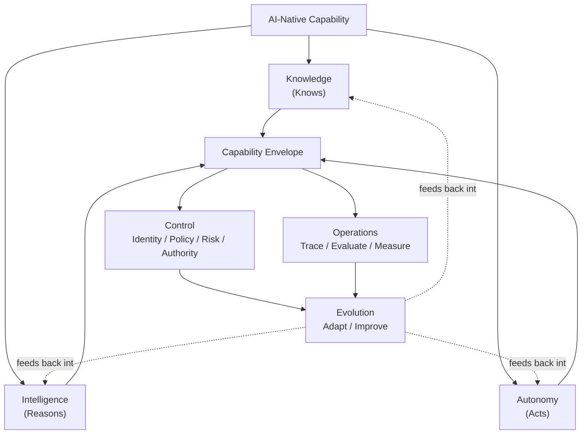

# AQEVON AI-Native Architecture Meta-Model

## Why a meta-model

Enterprise architecture frameworks (TOGAF, Zachman) tell you how to organize the practice of architecture. Software and cloud pattern languages (GoF, POSA, cloud design patterns) tell you how to solve recurring implementation problems. Neither gives an architect a vocabulary for a question that is now unavoidable in almost every enterprise system: **what does it mean for a system to know something, reason about it, and act on it — and how do we keep that system inside the bounds of what it is authorized to do, observe what it actually did, and change it as the world underneath it changes?**

The AQEVON meta-model exists to answer that question with a small, stable set of terms that every pattern, reference architecture, decision guide, and assessment in this repository is built on. It is deliberately narrow. It does not attempt to replace enterprise architecture, software architecture, or cloud architecture — it sits alongside them, scoped specifically to AI-native capability.

## The six domains

AI-native capability is organized into six domains, grouped into three functional pairs:

| Pair | Domains | Core question |
|---|---|---|
| **Capability** | Knowledge, Intelligence, Autonomy | What can the system know, reason about, and do? |
| **Envelope** | Control, Operations | What is the system allowed to do, and how do we know what it actually did? |
| **Change** | Evolution | How does the system get better over time without architectural decay? |

1. **Knowledge** — how the system knows things: what sources it draws from, how that knowledge is normalized, governed, kept fresh, and made retrievable with provenance intact.
2. **Intelligence** — how the system reasons: model selection and routing, context management, memory, and the reasoning process that turns knowledge and a request into a candidate answer or action.
3. **Autonomy** — how the system acts: the degree of independence a capability has to execute against the world without a human in the loop, and the architecture required to bound that independence safely.
4. **Control** — what the system is authorized to do: identity, policy, risk classification, and authority — the architecture that constrains Knowledge, Intelligence, and Autonomy to what is actually permitted.
5. **Operations** — what the system is observed to do: execution tracing, evaluation, monitoring, and graceful degradation — the architecture that makes AI behavior visible, measurable, and recoverable.
6. **Evolution** — how the system changes over time: the feedback loop that takes operational and evaluation signal and turns it into deliberate architectural change, rather than silent drift.

## Conceptual model

```
                     AI-NATIVE CAPABILITY
                              |
             +----------------+----------------+
             |                |                |
           KNOWS            REASONS           ACTS
             |                |                |
         Knowledge        Intelligence      Autonomy
             |                |                |
             +----------------+----------------+
                              |
                     CAPABILITY ENVELOPE
                              |
                    +---------+---------+
                    |                   |
                 CONTROL             OBSERVE
                    |                   |
               Identity              Trace
               Policy                Evaluate
               Risk                  Measure
               Authority
                    |                   |
                    +---------+---------+
                              |
                           EVOLVE
                              |
                       Adapt / Improve
```

Read top to bottom: a capability first **knows** (Knowledge), then **reasons** (Intelligence), then is positioned to **act** (Autonomy). Everything that capability can know, reason about, and do sits inside a **Capability Envelope** — bounded on one side by **Control** (what is authorized) and on the other by **Observe** (what is actually happening, via Operations). The whole envelope is subject to **Evolution** — the loop that turns observed reality back into architectural change.

This is a Mermaid rendering of the same relationship, used consistently across this repository:



## How the domains map to patterns

Every pattern in `patterns/` is assigned to exactly one of the six domains, and its ID is prefixed accordingly (`K-`, `I-`, `A-`, `C-`, `O-`, `E-`). This is what makes the pattern catalog navigable and what will eventually make it machine-readable (see `patterns/index.yaml`).

| Domain | Prefix | Directory |
|---|---|---|
| Knowledge | `K-` | `patterns/knowledge/` |
| Intelligence | `I-` | `patterns/intelligence/` |
| Autonomy | `A-` | `patterns/autonomy/` |
| Control | `C-` | `patterns/control/` |
| Operations | `O-` | `patterns/operations/` |
| Evolution | `E-` | `patterns/evolution/` |

## Relationship to other frameworks

The meta-model does not compete with existing frameworks — it answers a question none of them are scoped to answer directly:

| Framework | Core question |
|---|---|
| Zachman | What architectural things and perspectives must be represented? |
| TOGAF | How do we develop, govern, and manage enterprise architecture? |
| GoF / POSA | How do we solve recurring software design problems? |
| Cloud architecture patterns (AWS/Azure/GCP) | How do we solve recurring distributed-system problems? |
| AI / agent frameworks (LangChain, AutoGen, Semantic Kernel, etc.) | How do we implement and orchestrate intelligent components? |
| **AQEVON** | **How do we architect enterprises and systems whose capabilities include knowledge, intelligence, autonomy, control, operations, and continuous evolution?** |

An architect using TOGAF as their governance process, cloud provider patterns for infrastructure, and a specific agent framework for implementation can use AQEVON's meta-model as the layer that ties AI-native capability decisions back to enterprise architecture discipline — it is a lens, not a replacement.

## Status

This meta-model is a **synthesis (S)** — it does not claim to introduce new primitives (knowledge, reasoning, autonomy, governance, observability, and change management are all well-established concerns individually). Its contribution is the specific six-domain grouping and the explicit envelope/evolution relationship between them, proposed as a coherent, reusable structure for AI-native architecture work. See `research/prior-art-differentiation-matrix.md` for the domain-by-domain prior-art review.
