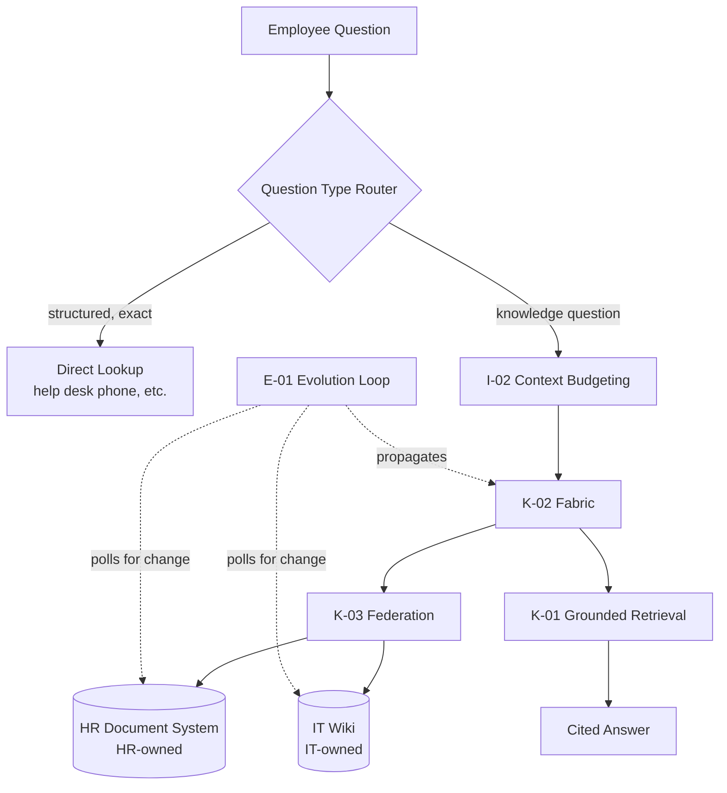

# 02 — Architecture Walkthrough

How `RA-01`'s components map onto this lab's scenario.

## Mapping table

| RA-01 Component | This Lab's Concrete Instance |
|---|---|
| `K-02` fabric | The governed layer that resolves which of HR/IT sources are relevant and authorized for the requesting employee's role, before any retrieval happens. |
| `K-03` federation | HR documents and IT wiki articles remain in their owning systems; the fabric queries both live rather than migrating content into a third store (see `04-decision-points.md`). |
| `K-01` grounded retrieval | Every generated answer must cite the specific HR document or IT article it drew from — implemented as a citation requirement enforced at the answer-generation step, not left to the model's discretion. |
| `E-01` evolution loop | A scheduled poll (cadence tuned separately per source — HR documents change rarely, IT articles more often) detects content changes and propagates them into what the fabric serves. |
| `I-02` context budgeting | For cross-source questions, both HR and IT candidate passages are ranked together and budgeted, rather than naively concatenating everything retrieved from both sources. |

## Access control flow

Role-based restriction (the "IT staff only" administrative articles) is enforced at the `K-02` fabric layer, evaluated against the requesting employee's actual role at query time — not filtered after generation, and not encoded only as a prompt instruction telling the model "don't share admin procedures with non-IT staff" (which would be `AP-03`, Prompt-as-Policy, applied to knowledge access rather than agent action).

## Why federation, not centralization, here

Both HR and IT source systems are actively maintained systems of record with existing update workflows and ownership. Migrating them into one centralized store would require either duplicating that maintenance workflow or accepting synchronization lag — see `04-decision-points.md` for the full `DF-05` analysis this lab applied.
