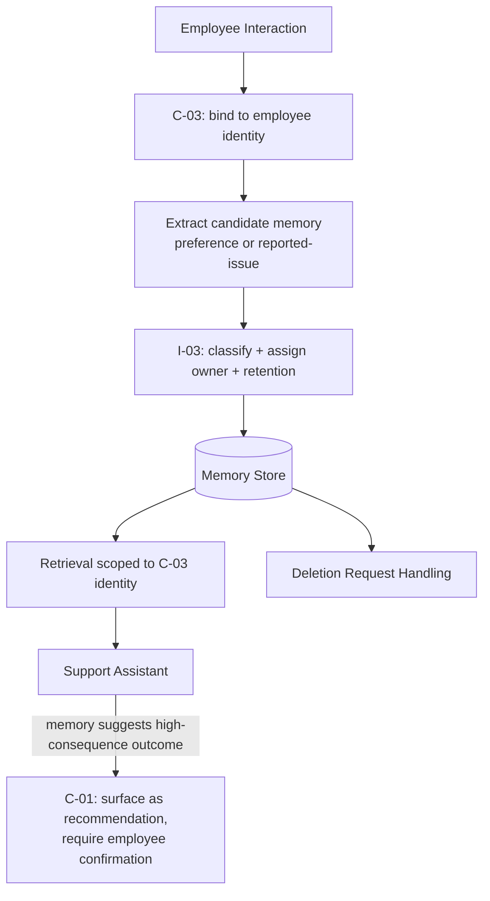

# 02 — Architecture Walkthrough

## Mapping table

| RA-02 Component | This Lab's Concrete Instance |
|---|---|
| `C-03` | Every interaction is bound to the employee's actual authenticated identity (not a session cookie or device ID) before any memory read or write occurs. |
| `I-03` | Two memory categories are defined with different classification/retention: "stated preference" (low sensitivity, long retention, e.g., 12 months) and "reported issue" (moderate sensitivity, shorter retention tied to issue resolution, e.g., 90 days after resolution). |
| `K-02` | Memory retrieval is subject to the same authorization discipline as the HR/IT knowledge retrieval from Lab 01 — treated as one more governed knowledge type, not a separate, less-governed category. |
| `C-01` | When a reported-issue memory suggests a high-consequence outcome (expedited equipment replacement eligibility), the assistant presents this as a recommendation the employee must actively confirm, rather than auto-escalating a ticket based on memory that might be stale. |

## Why two memory categories, not one

Treating "stated preference" and "reported issue" identically would either over-retain low-sensitivity preference data (unnecessary compliance exposure) or under-retain issue context needed for a legitimate follow-up window — `I-03` requires retention policy assigned per classification, not a single global policy applied to all memory indiscriminately.
