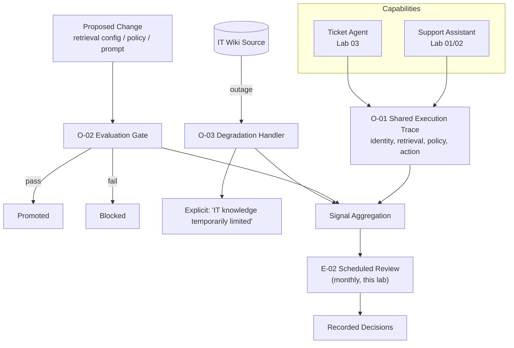

# 02 — Architecture Walkthrough

## Mapping table

| RA-04 Component | This Lab's Concrete Instance |
|---|---|
| `O-01` | A shared trace schema with fields: `execution_id`, `identity`, `capability`, `retrieval_sources` (Lab 01/02) or `proposed_action`/`policy_outcome` (Lab 03), `result`, `timestamp` — one schema, two capabilities. |
| `O-02` | An evaluation suite for the support assistant covering the question types from Lab 01's scenario, with a defined pass threshold; a promotion pipeline that runs this suite and blocks on failure. |
| `O-03` | A defined fallback for the IT-wiki source specifically (since Lab 01 identified it as one of two federated sources): when unavailable, the assistant answers from HR content alone with an explicit note that IT-related information may be incomplete, rather than silently returning a degraded or hallucinated IT answer. |
| `E-02` | A minimal monthly review that aggregates trace volume, evaluation pass/fail history, and degradation event frequency, producing a short recorded decision log. |

## Why the IT wiki specifically, for O-03

Lab 01 identified the IT wiki as one of two federated sources with its own polling cadence; it's a realistic, already-established dependency in this lab's continuity to use as the concrete `O-03` example, rather than inventing a new hypothetical dependency.

## How this closes assessment/worked-example.md's roadmap items

The Operations roadmap item ("Q14 — retrieval provenance not reconstructable") is directly addressed by this lab's `O-01` schema, which explicitly includes `retrieval_sources`. The Evolution-domain gap implicit in that same assessment (no review cycle existed for either capability) is addressed by this lab's `E-02` minimal cycle.
