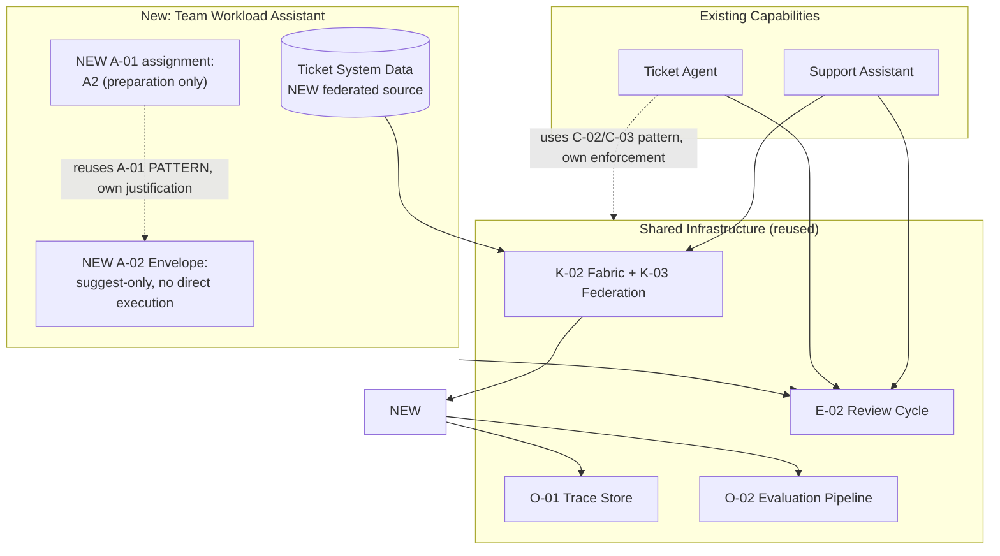

# 02 — Architecture Walkthrough

## The reuse audit

| Domain | Reused Directly | Extended | Genuinely New |
|---|---|---|---|
| Knowledge | `K-02` fabric infrastructure, `K-01` grounding discipline | `K-03` federation gains a third source (ticket system data) | New source connector for ticket system data, with its own access metadata (managers see only their own team's tickets) |
| Intelligence | — | `I-02` context budgeting applied to the new question types | — |
| Autonomy | The `A-01`/`A-02` pattern discipline (not the specific level) | — | A distinct autonomy-level assignment (A2, preparation only) and a new Envelope, since this capability's action (suggesting, not executing, a rebalance) is materially different from Lab 03's agent |
| Control | `C-03` identity-carrying discipline | `C-02` policy extended with a new rule: managers may only see/suggest for their own team | — |
| Operations | `O-01` trace schema and store, `O-02` evaluation pipeline mechanics | Trace schema gains a third `capability` value; evaluation suite gains new test cases | — |
| Evolution | `E-02` review cycle (same schedule, same job) | Aggregation now spans three capabilities instead of two | — |

## Why A2, not A3/A4, for this new capability

Unlike Lab 03's ticket agent, this capability only suggests a rebalancing — it does not execute one. Per `A-01`'s level definitions, "AI prepares materials/analysis a human's decision depends on, without proposing the decision" is closer to A2, or "AI proposes a decision; a human evaluates and decides independently" is A1 if the suggestion is framed as a specific proposal. This lab treats it as A2 (preparation) since the assistant surfaces workload data and a candidate rebalance for the manager's own judgment, without asserting the rebalance is the correct decision — see `04-decision-points.md` for the full `DF-02` reasoning.
