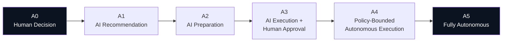

# A-01 — Autonomy Gradient

## Intent

Assign each AI capability an explicit, justified level of independent action — from full human decision-making to full autonomy — using a shared six-level scale, rather than treating autonomy as an implicit, uniform, all-or-nothing property of "using AI" or "using agents."

## Context

Organizations adopting AI capabilities face a recurring, poorly structured question: how much should this system be allowed to do on its own? In practice this decision is often made implicitly — by default framework behavior, by whoever configured the system last, or by momentum ("the demo worked autonomously, so we shipped it autonomously") — rather than as a deliberate architectural and risk decision.

## Problem

Without a shared vocabulary for degrees of autonomy, "the AI system is autonomous" is treated as binary, when in reality autonomy exists on a spectrum with very different risk, control, and observability requirements at each point. This ambiguity leads to two opposite failure patterns: capabilities that are far more autonomous than their actual risk profile justifies (see `AP-01`, `AP-06`), and capabilities kept at unnecessarily low autonomy that fail to deliver value the underlying model quality would actually support.

## Forces

- **Value vs. risk** — higher autonomy generally increases throughput and reduces human toil, but increases the consequence of an incorrect action.
- **Confidence vs. assumed confidence** — the model's or team's confidence in a capability's reliability is not the same as measured, evaluated confidence (see `O-02`).
- **Reversibility** — the cost of being wrong varies enormously by whether the action can be cheaply undone.
- **Regulatory constraint** — some domains have an externally mandated ceiling on permissible autonomy regardless of technical confidence.

## Solution

Define six autonomy levels and require every AI-native capability to be explicitly assigned one, with the assignment justified against business impact, risk, reversibility, measured confidence, regulation, and the presence of an enforced authority boundary and observability (see `framework/aqevon-ai-native-architecture.md` for the full decision inputs).

| Level | Name | Description |
|---|---|---|
| A0 | Human Decision | AI provides no decision support beyond, at most, information retrieval. |
| A1 | AI Recommendation | AI proposes a decision; a human evaluates and decides independently. |
| A2 | AI Preparation | AI prepares materials/analysis a human's decision depends on, without proposing the decision. |
| A3 | AI Execution + Human Approval | AI is ready to execute but requires explicit human approval first. |
| A4 | Policy-Bounded Autonomous Execution | AI executes without per-action approval, within an enforced policy boundary. |
| A5 | Fully Autonomous | No policy-bounded execution ceiling — reserved for narrowly scoped, low-risk, highly reversible actions. |

## Architecture

The gradient is not a maturity ladder every capability should climb — a capability's correct level is determined by its risk profile, not by organizational ambition. Most production systems show a deliberate mixture of levels across different capabilities, not a single system-wide setting.

## Sequence / Behavior

1. For each distinct AI capability (see `AI Capability Envelope` in `framework/aqevon-ai-native-architecture.md`), evaluate business impact, risk, reversibility, measured confidence, regulatory constraint, whether an enforced authority boundary exists (`C-01`, `C-02`), and whether execution is observable (`O-01`).
2. Assign the corresponding autonomy level explicitly, and record the justification.
3. Re-evaluate the assignment on a defined cadence and whenever a material input changes (new regulation, evaluation results showing lower-than-assumed confidence, an incident).

## When to Use

- Any AI-native capability, without exception — the gradient assignment is a required design decision, not an optional add-on for "advanced" use cases.

## When NOT to Use

- N/A as a pattern to skip; the only variation is which level is correct for a given capability, not whether to make the assessment.

## Benefits

- Provides a shared, comparable vocabulary across an organization's entire AI portfolio.
- Makes autonomy an explicit, auditable decision rather than an emergent default.

## Trade-offs

- Requires organizational discipline to actually perform and document the assessment for every capability, which adds process overhead relative to simply shipping default framework behavior.
- The six-level scale is a simplification; some capabilities may not map cleanly onto a single level across all their sub-actions, requiring the Envelope to be decomposed into finer-grained capabilities.

## Security Considerations

Autonomy level and authority boundary must be architecturally linked — assigning A4/A5 without a corresponding enforced policy boundary (`C-02`) is the specific failure this pattern is designed to prevent (see `AP-06`).

## Governance Considerations

Autonomy-level assignments and their justifications should be reviewable artifacts, not tribal knowledge — this is a natural input to the assessment framework's Autonomy Architecture dimension (see `assessment/`).

## Reliability Considerations

Higher autonomy levels require correspondingly stronger `O-03` (Graceful AI Degradation) behavior — the cost of a failure at A4/A5 is borne without a human catching it in real time.

## Observability Considerations

Every action taken at A3 and above should be traceable (`O-01`) with enough detail to reconstruct why the system acted as it did, given that a human did not (or did not fully) review the action before it took effect.

## Related Patterns

`A-02` (Bounded Agent — the primary architectural mechanism for implementing A3+ safely), `C-01`, `C-02` (the authority mechanisms that make higher autonomy levels defensible), `O-01`.

## Dependencies

Requires the AI Capability Envelope to be defined for the capability in question before an autonomy level can be meaningfully assigned.

## Anti-Patterns

`AP-01` (Agent by Default), `AP-06` (Autonomous Privilege Creep).

## Known Uses / Evidence

Autonomy-level scales are established in adjacent domains — most notably SAE's levels of driving automation (0–5) for autonomous vehicles, which is a widely cited external analogy for structuring AI autonomy discussions. AQEVON's A0–A5 scale is a **proposed** adaptation of this style of graduated scale to enterprise AI-native capability specifically, not a direct reuse of the SAE levels' technical definitions, and has not yet been validated against other AI-specific autonomy scales that may already exist in the literature. Evidence required — see `research/prior-art-differentiation-matrix.md`.

## Vendor Mappings

Vendor-neutral; autonomy-level enforcement is typically implemented via the mechanisms described in `C-02` (Policy-Bounded Action) and varies by orchestration platform.

## Research Questions

- Do other published AI-specific autonomy scales already exist that this pattern should be reconciled with or explicitly differentiated from?
- What is the right unit of assessment when a single agent's actions span multiple autonomy-appropriate levels within one task?

## Revision History

- 0.1.0 (2026-08-24) — Initial pattern card. Classification hypothesis: P.
