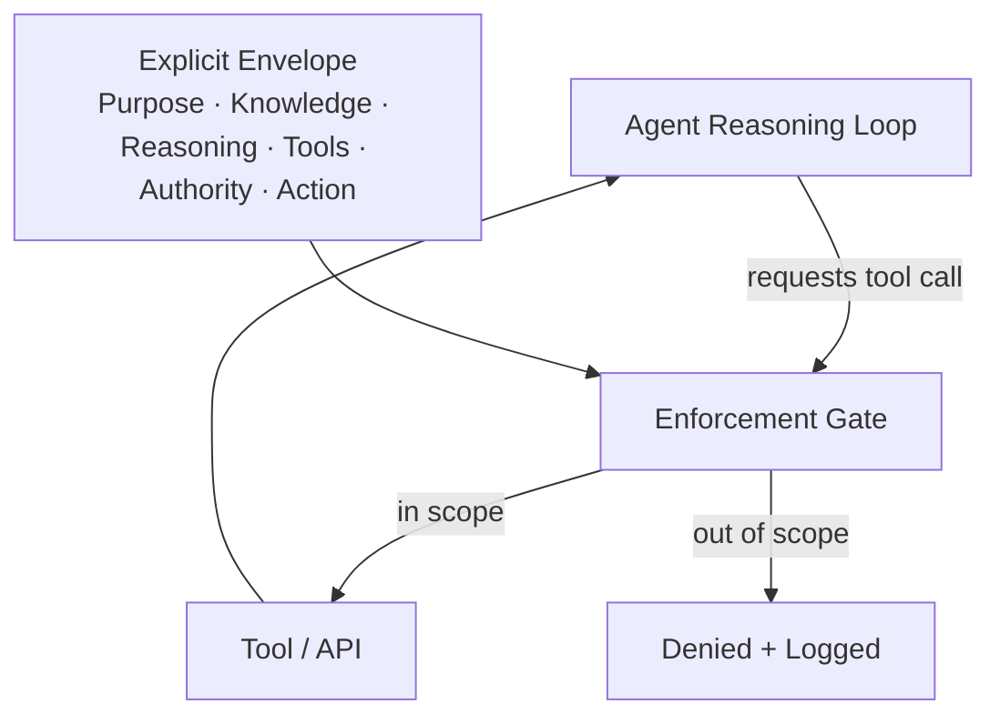

# A-02 — Bounded Agent

## Intent

Scope an agentic capability's tools, knowledge access, autonomy level, and authority explicitly and enforce that scope at runtime, rather than granting an agent broad, implicit access and relying on prompt instructions to keep it in bounds.

## Context

An agentic capability needs to take multiple steps, call tools, and make intermediate decisions to complete a task — a case where the `A-01` assessment has concluded some degree of autonomy (typically A2–A4) is appropriate.

## Problem

The common, unengineered default is to give an agent broad tool access and knowledge access "in case it needs it," constraining behavior only through natural-language system-prompt instructions ("only use the ticketing tool for read operations," "don't access customer PII"). Prompt instructions are not an enforcement mechanism — they are a request the model may or may not honor, especially under adversarial input or edge-case reasoning. This is the specific failure `AP-03` (Prompt-as-Policy) names.

## Solution

Define an explicit, enforced boundary around the agent using the AI Capability Envelope's six facets (Purpose, Knowledge, Reasoning, Tools, Authority, Action — see `framework/aqevon-ai-native-architecture.md`), implemented so that the agent's runtime environment — not the model's judgment — prevents out-of-scope actions from executing.

## Architecture

The enforcement gate — not the agent's own prompt-following behavior — is what makes this pattern "bounded" rather than merely "instructed."

## Forces

- **Capability vs. blast radius** — broader tool/knowledge access makes the agent more capable but increases the consequence of a reasoning error.
- **Enforcement granularity vs. engineering cost** — fine-grained, per-action enforcement is more secure but more expensive to build and maintain than coarse-grained, all-or-nothing tool access.
- **Static scoping vs. task-appropriate flexibility** — an overly narrow static scope may block legitimate task variations; the boundary must be scoped to the capability's actual Purpose, not arbitrarily minimized.

## Sequence / Behavior

1. Define the agent's Envelope explicitly before implementation: what it exists to do, what it may know, what tools it may call, under what authority, and what actions are in scope.
2. Implement an enforcement gate — outside the model's own reasoning — that checks every tool call and action request against the defined scope before allowing execution.
3. Log both allowed and denied actions (see `O-01`).
4. Route out-of-scope requests to an explicit denial-and-escalation path, not a silent failure.

## When to Use

- Any agentic capability at autonomy level A2 or above.

## When NOT to Use

- Simple, single-step AI interactions with no tool use or multi-step reasoning — the overhead of a full enforcement gate is not justified for a capability that is not agentic in the first place.

## Benefits

- Converts "the agent shouldn't do X" from a hope into an enforced guarantee.
- Provides a clear, reviewable scope definition that supports both security review and the `A-01` autonomy-level justification.

## Trade-offs

- Requires upfront design investment to define the Envelope precisely, which can slow initial development relative to an unbounded agent.
- Overly rigid enforcement can produce a frustrating user experience if the boundary is scoped too narrowly relative to real task variation.

## Security Considerations

The enforcement gate is a security control and should be designed, reviewed, and tested with the same rigor as any other authorization mechanism — not treated as a soft, best-effort filter.

## Governance Considerations

The Envelope definition is the artifact that should be reviewed and approved as part of any AI capability's governance sign-off — see `assessment/` for how this maps to organizational maturity.

## Reliability Considerations

Denied actions must have a defined recovery path (retry with corrected scope request, escalate to human, fail gracefully) rather than leaving the agent's task incomplete with no signal to the user or operator.

## Observability Considerations

Both successful and denied tool calls should appear in the execution trace (`O-01`) — denied-action patterns are a leading indicator of either a misconfigured boundary or an attempted scope violation worth investigating.

## Related Patterns

`A-01` (Autonomy Gradient — determines what autonomy level the agent should be bounded to), `C-02` (Policy-Bounded Action — the general control-domain pattern this specializes for agents), `C-03` (Identity-Carrying Agent).

## Dependencies

Requires an enforcement mechanism capable of intercepting and evaluating tool calls before execution — this is typically implemented at the orchestration/runtime layer, not inside the model.

## Anti-Patterns

`AP-01` (Agent by Default), `AP-06` (Autonomous Privilege Creep), `AP-03` (Prompt-as-Policy — the specific anti-pattern this pattern is the direct correction for).

## Known Uses / Evidence

Scoped/sandboxed agent execution is a widely discussed and increasingly implemented practice across agent-orchestration frameworks and enterprise AI platforms; the general principle (least-privilege access enforced outside the reasoning component) is a direct application of the long-established principle of least privilege from software security. AQEVON's contribution is framing this specifically through the AI Capability Envelope's six facets as a consistent, reusable scoping structure. Classified `S` — synthesis of an established security principle applied to a specific AI-native architecture concern.

## Vendor Mappings

Vendor-neutral; enforcement gates may be implemented via API gateways, orchestration-framework middleware, or purpose-built agent-runtime policy engines. See `RA-03`.

## Research Questions

- What is the right default granularity for tool-scope enforcement (per-tool, per-operation, per-parameter)?
- How should Envelope scope evolve safely as an agent's task set legitimately grows, without regressing to unbounded access by accretion?

## Revision History

- 0.1.0 (2026-08-24) — Initial pattern card. Classification hypothesis: S.
