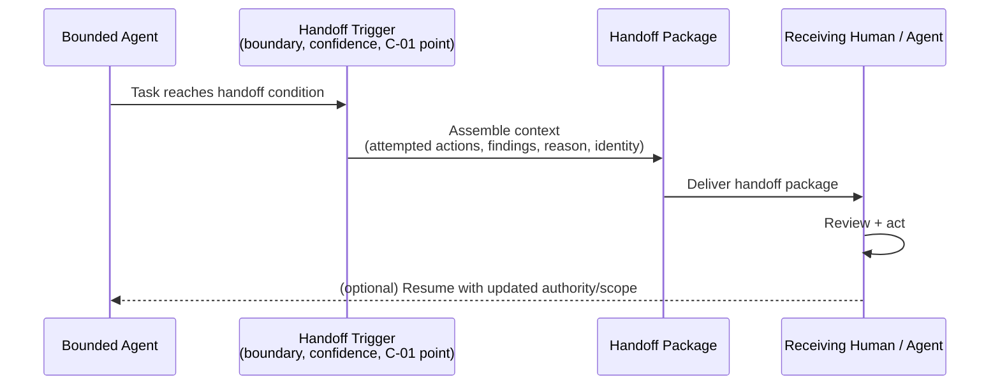

# A-03 — Agent Handoff

## Intent

Transfer a task between an agent and a human, or between two agents, with full context and accountability preserved across the handoff, so that the receiving party is not left reconstructing what has already happened.

## Context

A `A-02` bounded agent reaches the edge of its scope — an autonomy-boundary denial, a confidence threshold not met, an explicit `C-01` human authorization point, or a task segment better handled by a differently-scoped agent.

## Problem

Handoffs implemented as an afterthought typically lose context: a human receiving an escalated task sees only "the AI couldn't handle this" with no record of what was tried, what was found, or why the agent stopped — forcing the human to start over. Agent-to-agent handoffs without a defined protocol can silently drop authority/identity context, breaking the chain of accountability this framework treats as fundamental (`C-03`).

## Forces

- **Context completeness vs. handoff latency** — richer context transfer takes longer to assemble and transmit.
- **Autonomy of the receiving party** — a human or downstream agent receiving a handoff needs enough context to act, but not so much that reviewing the handoff itself becomes the bottleneck.
- **Accountability continuity** — the identity and authority basis for continued action must survive the handoff without ambiguity about who is now accountable.

## Solution

Define an explicit handoff protocol: a structured package containing what was attempted, what was found, why the handoff is occurring, and the current state of any relevant Autonomy Gradient / Envelope context, transferred to the receiving human or agent along with a clear statement of what action is now expected of them.

## Architecture

## Sequence / Behavior

1. The agent's execution reaches a defined handoff trigger — an authorization boundary (`C-01`), a low-confidence result, an out-of-scope request denied by `A-02`'s enforcement gate, or an explicit task-completion condition requiring downstream action.
2. A structured handoff package is assembled: task history, findings, the specific reason for handoff, and the identity/authority context needed for the receiver to act.
3. The package is delivered to the appropriate human or agent, with an explicit statement of the expected next action.
4. If work resumes with the originating agent afterward, updated scope or authority is passed back explicitly, not assumed to persist unchanged.

## When to Use

- Any bounded agent capability where reaching the edge of scope, confidence, or authority is an expected, routine occurrence, not an exceptional failure.
- Multi-agent architectures where different agents are scoped to different task segments.

## When NOT to Use

- Fully self-contained tasks with no realistic handoff condition — adding a handoff protocol to a capability that never needs one is unnecessary complexity.

## Benefits

- Preserves productivity for the receiving party — no redundant reconstruction of already-known context.
- Maintains an unbroken accountability chain across the handoff, supporting `O-01` execution tracing end-to-end.

## Trade-offs

- Requires upfront design of the handoff package structure, which varies by task type and may need per-capability customization.
- Poorly tuned handoff triggers can create excessive escalation volume, undermining the value of autonomy in the first place (see `AP-08` for the related failure of approval steps becoming meaningless if they are too frequent to review properly).

## Security Considerations

The handoff package itself may contain sensitive context and must be delivered under the same access controls as the underlying knowledge and identity data it references.

## Governance Considerations

Handoff reasons should be categorized and reviewable in aggregate — a spike in a specific handoff reason is a strong signal for `E-02` (AI Architecture Evolution Loop) that the underlying capability's scope or confidence needs revisiting.

## Reliability Considerations

If the receiving party is unavailable (human offline, downstream agent capacity exceeded), the handoff protocol must define queuing or escalation behavior rather than silently dropping the task.

## Observability Considerations

Every handoff — its trigger, package contents summary, and eventual resolution — should be part of the execution trace (`O-01`), enabling end-to-end reconstruction of a task that crossed multiple agents and/or humans.

## Related Patterns

`A-02` (Bounded Agent — handoff triggers often originate from its enforcement gate), `C-01` (Human Authorization Boundary — a primary handoff trigger), `O-01` (AI Execution Trace).

## Dependencies

Requires the originating agent's execution state to be structured enough to summarize into a handoff package — an agent with no intermediate state tracking cannot hand off meaningfully.

## Anti-Patterns

`AP-08` (Human-in-the-Loop Theater — a handoff that delivers no real context reduces the "human in the loop" step to this anti-pattern in practice).

## Known Uses / Evidence

Human handoff in escalation-based systems (contact-center "escalate to a human agent" workflows) is long-established practice, predating AI-specific agents. Agent-to-agent handoff protocols are an active, newer area of development across multi-agent orchestration frameworks. AQEVON's contribution is unifying human and agent-to-agent handoff under one pattern with a consistent context-package and accountability requirement. Classified `E/S` — the human-handoff half is established; the agent-to-agent half and the unified framing are AQEVON synthesis.

## Vendor Mappings

Vendor-neutral; several multi-agent orchestration frameworks provide native handoff or delegation primitives with varying degrees of context preservation — implementation-specific comparison is out of scope for the conceptual pattern card.

## Research Questions

- What handoff-package schema generalizes well across task types without becoming so generic it loses usefulness?
- How should handoff quality itself be evaluated (did the receiving party actually have what they needed)?

## Revision History

- 0.1.0 (2026-08-24) — Initial pattern card. Classification hypothesis: E/S.
