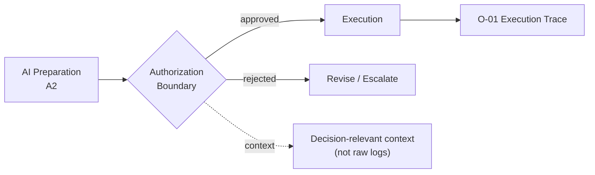

# C-01 — Human Authorization Boundary

## Intent

Define the explicit point(s) at which an AI capability requires human authorization before an action takes effect, so that the presence and placement of human review is a deliberate architectural decision rather than an incidental artifact of however the system happened to be built.

## Context

Any AI capability operating above autonomy level A2 (`A-01`) will, at some point, take an action with real-world consequence — sending a communication, modifying a record, executing a transaction, committing an organization to a decision. Some subset of these actions warrant human review before they take effect.

## Problem

Human review is frequently added reflexively ("let's put a human in the loop to be safe") without specifying what the human is actually meant to catch, what information they need to catch it, or how much time they realistically have to review. This produces boundaries that exist on paper but not in practice — see `AP-08` (Human-in-the-Loop Theater) — where approval becomes a rubber stamp rather than a genuine check.

## Forces

- **Safety vs. throughput** — every authorization point adds latency and reduces the value of automation; too many boundaries erode the case for AI-native architecture in the first place.
- **Genuine review capacity vs. approval volume** — a human can only meaningfully review a bounded number of decisions per unit time with the context each requires.
- **Placement precision** — a boundary placed too early in a workflow lacks the context to be a meaningful check; placed too late, it may be effectively unable to prevent consequence (the action has already partially executed).

## Solution

Place authorization boundaries deliberately at points in a capability's workflow where a human can make a materially better-informed decision than the point before or after — and provision each boundary with exactly the context needed for genuine review, not a generic approve/reject prompt.

## Architecture

## Sequence / Behavior

1. For each AI capability, identify the specific decision points where consequence, reversibility, or risk justify human review (informed by the `A-01` assessment).
2. At each boundary, define exactly what context the human needs to make a genuine judgment — not the full raw execution trace, but a decision-relevant summary.
3. Route the action to the boundary and hold execution pending explicit approval or rejection.
4. Record the authorization decision itself as part of the execution trace (`O-01`), including who approved, when, and on what information.

## When to Use

- Any AI capability at autonomy level A3, and selectively within A2 capabilities where a downstream human decision depends on AI-prepared material.

## When NOT to Use

- Capabilities operating within a well-justified A4/A5 policy boundary (`C-02`) where per-action human review has been deliberately traded for policy-bounded autonomous execution — adding a redundant authorization boundary here defeats the purpose of that design decision.

## Benefits

- Converts "there's a human in the loop" from an assumption into a specific, reviewable, and testable design decision.
- Reduces approval fatigue by concentrating review capacity at the points where it is most likely to catch a real error.

## Trade-offs

- Requires genuine design effort to determine correct placement and context provisioning — a boundary added without this effort risks becoming theater (`AP-08`).
- Adds latency at each boundary, which must be weighed against the capability's throughput requirements.

## Security Considerations

The authorization boundary itself must be tamper-resistant — an agent should not be able to bypass, spoof, or auto-approve its own pending authorization request.

## Governance Considerations

The set of defined authorization boundaries across an organization's AI portfolio is a primary governance artifact — it is the concrete answer to "where do humans actually retain control," and should be reviewable independent of any single capability's implementation.

## Reliability Considerations

Define a timeout/escalation policy for authorization requests that go unanswered — a boundary with no defined behavior for "the human didn't respond" creates an availability failure mode disguised as a safety feature.

## Observability Considerations

Every authorization decision — approved, rejected, timed out — should be logged with the context that was presented to the human, enabling later review of whether the boundary functioned as a genuine check (see `AP-08` for the failure this observability data is meant to detect).

## Related Patterns

`A-01` (Autonomy Gradient — determines which capabilities require an authorization boundary), `A-03` (Agent Handoff — a common trigger and delivery mechanism for reaching a boundary), `C-02` (Policy-Bounded Action — the alternative/complementary control mechanism for higher autonomy levels).

## Dependencies

Requires a workflow/orchestration layer capable of pausing execution pending an external decision, and a defined interface for presenting decision-relevant context to the human reviewer.

## Anti-Patterns

`AP-08` (Human-in-the-Loop Theater — the direct failure mode of a poorly designed boundary), `AP-01` (Agent by Default — a symptom of skipping authorization-boundary design entirely).

## Known Uses / Evidence

Human-in-the-loop approval workflows are long-established practice in software systems generally (change-approval boards, financial transaction approval limits, content moderation review queues), predating AI-specific applications. AQEVON's contribution is the explicit requirement that each boundary be provisioned with decision-relevant context and evaluated for genuine review capacity, rather than treated as satisfied by the mere existence of an approval step. Classified `E/S` — the underlying practice is established; the context-provisioning and genuine-review-capacity discipline is AQEVON synthesis.

## Vendor Mappings

Vendor-neutral; workflow/orchestration platforms and agent frameworks vary in native support for pausable, human-reviewable execution steps.

## Research Questions

- What is the right way to measure whether an authorization boundary is providing genuine review versus rubber-stamping, short of an incident revealing it after the fact?
- How should authorization-boundary placement adapt as measured approval patterns reveal a boundary is consistently uninformative (e.g., near-100% approval rate with no evidence of substantive review)?

## Revision History

- 0.1.0 (2026-08-24) — Initial pattern card. Classification hypothesis: E/S.
