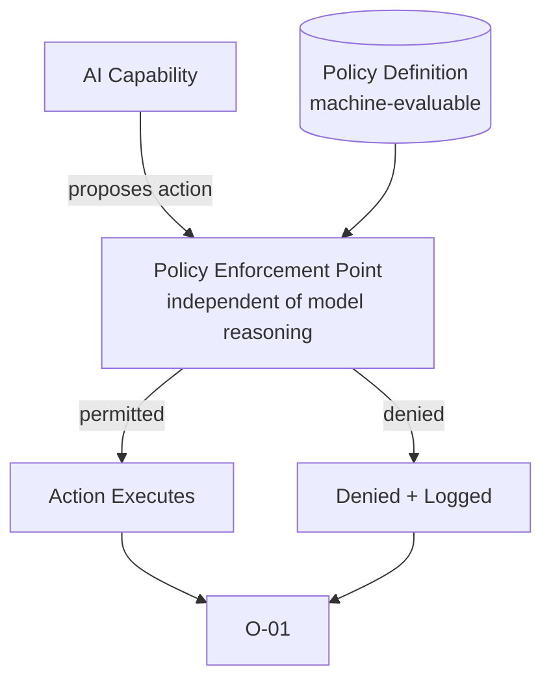

# C-02 — Policy-Bounded Action

## Intent

Constrain what actions an AI capability may take using an enforced, machine-evaluable policy — rather than instructions embedded in a prompt — so that autonomous execution (A4/A5 on the `A-01` gradient) remains defensible without requiring per-action human review.

## Context

A capability has been deliberately assigned a policy-bounded autonomous execution level, meaning it will act without per-action human approval (`C-01`) as long as its actions remain within a defined boundary.

## Problem

Without a distinct, externally enforced policy layer, the only thing standing between an autonomous agent and an out-of-scope action is the model's own prompt-following behavior — which is not an enforcement mechanism (see `AP-03`). This is the general control-domain problem that `A-02` (Bounded Agent) specializes for the specific case of agentic tool use; `C-02` is the underlying pattern.

## Forces

- **Autonomy vs. verifiability** — a policy must be expressive enough to permit legitimate autonomous action, yet simple enough to be reliably, mechanically evaluated.
- **Static policy vs. contextual nuance** — real-world "should this action be allowed" questions often have context-dependent answers that are hard to fully encode in a static policy.
- **Enforcement location** — policy evaluated inside the same process as the model's own reasoning offers weaker guarantees than policy evaluated by an independent, non-bypassable component.

## Solution

Express the boundary of permitted action as an explicit, machine-evaluable policy — not natural-language instruction — and evaluate every action against that policy in a component the AI capability's own reasoning cannot alter or bypass.

## Architecture

## Sequence / Behavior

1. Define the policy as a machine-evaluable rule set — not a prompt instruction — covering the specific dimensions of action the capability is permitted to take (which the `A-02` Envelope facets typically supply for agentic cases).
2. Implement a policy enforcement point that is architecturally independent of the model's own reasoning process — it evaluates proposed actions, it does not participate in generating them.
3. Route every proposed action through the enforcement point before execution; deny and log anything outside policy.
4. Review policy definitions on a defined cadence and whenever the capability's assigned autonomy level or Envelope changes.

## When to Use

- Any AI capability operating at autonomy level A4 or above, where no per-action human approval exists.
- Selectively at A3, as a defense-in-depth layer alongside the human authorization boundary.

## When NOT to Use

- Capabilities where every action already passes through a `C-01` human authorization boundary and the added engineering cost of a separate enforced policy layer is not justified by the residual risk between boundary and execution.

## Benefits

- Provides a real, testable enforcement guarantee rather than a request the model may or may not honor.
- Decouples "what the agent is allowed to do" from "how the agent decides what to try," making both easier to reason about and audit independently.

## Trade-offs

- Policy authoring and maintenance is a nontrivial ongoing discipline, not a one-time configuration step.
- Overly rigid policy can block legitimate edge-case actions that a human would obviously approve, requiring either a well-designed exception path or acceptance of some false-positive denial rate.

## Security Considerations

The policy enforcement point is itself a security-critical component; it should be designed, deployed, and access-controlled with the rigor of any other authorization system, including protection against an agent attempting to modify its own governing policy.

## Governance Considerations

Policy definitions are the concrete, reviewable artifact that should be presented for any A4/A5 capability's governance sign-off — an autonomy-level assignment without a corresponding documented policy is itself a governance gap (see `AP-06`).

## Reliability Considerations

Policy evaluation must fail closed (deny by default on evaluation error), not fail open — an enforcement point that permits action when it cannot determine policy compliance defeats its own purpose.

## Observability Considerations

Both permitted and denied actions should be logged with the specific policy clause that determined the outcome (`O-01`), enabling audit of why a given action was allowed or blocked.

## Related Patterns

`A-01` (Autonomy Gradient — determines whether policy-bounded execution is the appropriate control mechanism), `A-02` (Bounded Agent — the agentic-tool-use specialization of this general pattern), `C-01` (Human Authorization Boundary — the complementary/alternative control mechanism), `C-03` (Identity-Carrying Agent — policy evaluation typically depends on the acting identity).

## Dependencies

Requires a policy definition language/format expressive enough for the capability's action space, and an enforcement point with the technical ability to intercept and block actions before they take effect.

## Anti-Patterns

`AP-03` (Prompt-as-Policy — the specific failure this pattern directly corrects), `AP-06` (Autonomous Privilege Creep — what results when policy is absent or not kept current with an agent's actual granted scope).

## Known Uses / Evidence

Policy-as-code and externalized authorization (policy engines separate from application logic) are established practice in software security more broadly, predating AI-specific systems. AQEVON's contribution is applying this established externalized-policy discipline specifically to AI-native autonomous action, as the general control-domain pattern beneath `A-02`'s agent-specific specialization. Classified `S` — synthesis of an established security architecture principle applied to this domain.

## Vendor Mappings

Vendor-neutral; may be implemented via general-purpose policy engines, API gateway policy layers, or orchestration-framework-native authorization hooks. See `RA-03`.

## Research Questions

- What policy expressiveness is sufficient for the majority of enterprise AI-native use cases without requiring a full general-purpose programming environment (which would itself be harder to verify)?
- How should policy be versioned and rolled back safely when a policy change is found to be too permissive after the fact?

## Revision History

- 0.1.0 (2026-08-24) — Initial pattern card. Classification hypothesis: S.
