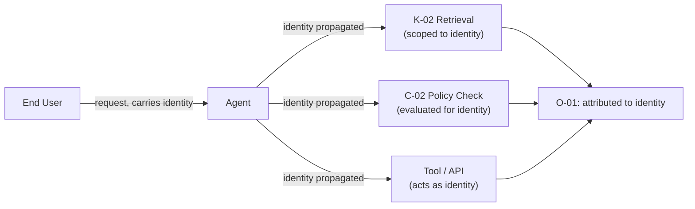

# C-03 — Identity-Carrying Agent

## Intent

Attribute every agent action to a specific, auditable identity — the end user on whose behalf it acts, the service or system identity it runs as, or both — rather than a shared, ambient credential that makes individual actions indistinguishable after the fact.

## Context

An AI capability acts on knowledge sources (`K-02`), takes actions subject to policy (`C-02`), and produces an execution trace (`O-01`) — all of which depend on knowing, precisely, who or what the acting identity was for a given action.

## Problem

The common, unengineered default is to run an agent under a single shared service credential with broad access, regardless of which end user's request triggered a given action. This collapses accountability: knowledge retrieval cannot be scoped per-user (any user's request can retrieve anything the shared credential can access), actions cannot be attributed to the responsible party, and an incident investigation cannot distinguish "the agent acting for user A" from "the agent acting for user B."

## Forces

- **Implementation simplicity vs. accountability** — a single shared credential is far simpler to implement and operate than per-user identity propagation through every layer of an agentic system.
- **Delegation fidelity vs. system complexity** — accurately carrying "acting on behalf of X, under Y's own permissions" through multi-step, multi-tool agent execution is architecturally nontrivial.
- **Performance** — per-identity authorization checks at every step add latency relative to a single broadly-scoped credential.

## Solution

Propagate a specific, verifiable identity — the originating user's identity, a distinct service identity, or an explicit delegation chain of both — through every layer of an agent's execution, and require every downstream authorization decision (knowledge retrieval, tool call, policy evaluation) to be evaluated against that carried identity, not a shared ambient credential.

## Architecture

## Sequence / Behavior

1. At the point a request enters an agentic capability, establish and cryptographically or systemically bind the acting identity — the originating user, a distinct service identity, or an explicit delegation record of both.
2. Propagate this identity through every subsequent step: knowledge retrieval calls, tool/API invocations, and policy evaluations must all receive and honor the carried identity rather than defaulting to a shared credential's broader access.
3. Record the identity against every logged action in the execution trace (`O-01`).
4. Where an agent must act with authority broader than the originating user's own (e.g., an automated process acting on a schedule), use an explicit, distinct service identity rather than silently borrowing elevated shared access.

## When to Use

- Any agentic capability that retrieves knowledge or takes actions on behalf of, or in response to, a specific end user or accountable role.

## When NOT to Use

- Fully anonymous, non-personalized capabilities with no per-user data access or accountability requirement, where a single well-scoped service identity is already the correct and sufficient model.

## Benefits

- Enables correctly scoped knowledge retrieval — a user only sees what they are actually authorized to see, even when the retrieval is performed by an agent rather than the user directly.
- Makes post-incident investigation tractable: every action traces to a specific accountable identity, not an ambiguous shared credential.

## Trade-offs

- Requires identity propagation to be designed into the system from the start; retrofitting it onto an agent built around a shared credential is a significant re-architecture.
- Adds per-identity authorization overhead at each step relative to a single broadly-scoped credential.

## Security Considerations

A shared ambient credential is a standing security liability independent of AI — this pattern is a direct application of avoiding that liability in the specific context of agentic systems, where the number and variety of downstream calls made "on behalf of" a request is typically much higher than in traditional application request handling.

## Governance Considerations

Identity-carrying is a prerequisite for meaningful governance review of an AI capability's access — without it, "what can this capability access" cannot be answered per-user, only for the shared credential's maximum scope.

## Reliability Considerations

Identity propagation failures (a downstream call losing or defaulting the carried identity) should fail closed — denying the action — rather than silently falling back to a broader, unintended scope.

## Observability Considerations

Every entry in the execution trace (`O-01`) should carry the acting identity as a first-class, queryable field, enabling both per-user audit ("what did the agent do on my behalf") and per-incident audit ("what happened under this identity").

## Related Patterns

`C-02` (Policy-Bounded Action — policy evaluation depends on the carried identity), `O-01` (AI Execution Trace — identity is a required trace field), `K-02` (Enterprise Knowledge Fabric — retrieval must be scoped to the carried identity, not a shared credential).

## Dependencies

Requires integration with the organization's identity provider and a technical mechanism (token propagation, delegation chain, or equivalent) capable of carrying identity through multi-step, multi-tool agent execution without loss.

## Anti-Patterns

`AP-06` (Autonomous Privilege Creep — a shared, broadly-scoped ambient credential is a direct enabler of this anti-pattern, since expanded access is invisible at the per-user level).

## Known Uses / Evidence

Identity propagation and the avoidance of shared ambient credentials are well-established principles in enterprise identity and access management generally (e.g., OAuth delegation, service-to-service identity federation), predating AI-specific systems. AQEVON's contribution — and the reason this is classified `P` rather than `S` — is the specific emphasis on identity-carrying as a load-bearing architectural requirement for agentic AI systems in particular, where the volume and autonomy of downstream calls made "on behalf of" a request materially increases the consequence of getting this wrong relative to traditional request-handling architectures. This framing has not yet been validated against how consistently current agent-orchestration frameworks actually support it by default.

## Vendor Mappings

Vendor-neutral; identity propagation support varies significantly across current agent-orchestration frameworks, several of which default to a single shared credential model. See `RA-03` for implementation-specific gap analysis.

## Research Questions

- How well do current mainstream agent-orchestration frameworks support faithful identity propagation across multi-tool, multi-step execution today, and where are the gaps?
- What is the right model for delegation chains that legitimately mix user and service identity within a single agent execution (e.g., a scheduled agent acting on stored user consent)?

## Revision History

- 0.1.0 (2026-08-24) — Initial pattern card. Classification hypothesis: P.
