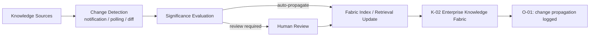

# E-01 — Knowledge Evolution Loop

## Intent

Continuously detect, evaluate, and incorporate change in the underlying Enterprise Knowledge Fabric (`K-02`) sources, so that grounded AI capabilities remain accurate as the organization's actual knowledge changes, rather than silently drifting out of date against sources that were correct only at initial indexing time.

## Context

The `K-02` fabric spans documents, structured data, applications, and systems — nearly all of which change over time: policies are revised, product data updates, organizational structure shifts, prior decisions are superseded.

## Problem

Knowledge integration is frequently treated as a one-time or infrequently-batched project: sources are connected and indexed at build time, with no defined ongoing process for detecting when a source has changed, evaluating whether that change should propagate, and updating what the AI capability retrieves. The result is retrieval that appears grounded (`K-01`) — every claim traces to a source — but the source itself is stale, producing confidently wrong answers that are harder to catch than an obviously unGrounded one.

## Forces

- **Freshness vs. update cost** — more frequent re-synchronization of every knowledge source is more accurate but more operationally expensive, especially across a federated (`K-03`) source set with varying native change-detection capability.
- **Automatic propagation vs. review** — some knowledge changes should propagate to retrieval automatically; others (e.g., a source correction that materially changes a previously-cited fact) may warrant review before propagating.
- **Detection granularity** — some sources natively support change notification; others require polling or diffing, with correspondingly different latency between a real-world change and its reflection in retrieval.

## Solution

Define an explicit, recurring loop — not a one-time integration — that detects change in each governed knowledge source, evaluates the significance of the change, and propagates it into what the fabric serves at retrieval time, with the loop's cadence and detection mechanism matched to each source's actual rate and mode of change.

## Architecture

## Sequence / Behavior

1. For each governed knowledge source, define a change-detection mechanism appropriate to that source (native change notification, scheduled polling, content diffing).
2. On detected change, evaluate its significance — a typo correction may auto-propagate, while a substantive policy reversal may warrant review before affecting what the fabric serves.
3. Propagate approved changes into the fabric's retrieval-serving index/state.
4. Log the change and its propagation in the execution/operational trace, so that "when did the fabric learn X" is itself an answerable, auditable question.

## When to Use

- Any `K-02` Enterprise Knowledge Fabric implementation drawing on sources that change at a meaningful rate relative to the capability's freshness requirements — in practice, nearly all production knowledge fabric implementations.

## When NOT to Use

- Knowledge sources that are genuinely static or change so infrequently that a manual, ad hoc re-sync process is proportionate — though this should be a documented decision per source, not an unexamined default across the whole fabric.

## Benefits

- Keeps grounded retrieval actually grounded in current reality, not just traceable to a source that was correct at some point in the past.
- Makes staleness a measured, managed property of the fabric rather than an invisible, accumulating risk.

## Trade-offs

- Requires ongoing operational investment per source, proportional to the number and diversity of sources in the fabric.
- Significance evaluation logic (what warrants review vs. auto-propagation) requires careful design — too permissive risks propagating low-quality changes; too conservative recreates the staleness problem via review backlog.

## Security Considerations

Change propagation must preserve the source's original access-control and provenance metadata — an update pipeline that loses classification information on write is a specific way `K-02`'s governance guarantees can quietly erode over time.

## Governance Considerations

The review path for significant changes is a natural integration point with existing content-governance processes (e.g., a policy document's own approval workflow) — this loop should plug into those processes rather than duplicate them.

## Reliability Considerations

A silently broken change-detection mechanism for a given source produces exactly the staleness this pattern is meant to prevent, while appearing operationally healthy — detection health should itself be monitored.

## Observability Considerations

Track, per source: last detected change, last successful propagation, and current staleness (time since last verified sync) — these are direct operational health metrics for the fabric as a whole.

## Related Patterns

`K-02` (Enterprise Knowledge Fabric — the system this loop keeps current), `K-03` (Knowledge Federation — federated sources typically vary widely in native change-detection capability), `O-01` (AI Execution Trace — records change propagation events).

## Dependencies

Requires per-source change-detection capability (native or built) and an update pipeline capable of propagating changes into the fabric's retrieval-serving layer without a full re-index each time.

## Anti-Patterns

`AP-04` (Vector Database as Knowledge Architecture — a plain vector index with no defined re-sync discipline is a common concrete instance of the staleness problem this pattern addresses).

## Known Uses / Evidence

Change-data-capture and incremental index-update mechanisms are established practice in data engineering and search-system architecture generally. AQEVON's contribution is framing this specifically as a required, ongoing architectural loop for the Enterprise Knowledge Fabric — with explicit significance-evaluation and review-path design — rather than an implementation detail left to whichever sync job happened to be built. Classified `S/P` — synthesis of established data-engineering practice, with the fabric-specific significance-evaluation and review framing proposed pending further validation.

## Vendor Mappings

Vendor-neutral; change-detection and incremental indexing mechanisms vary widely by source system and knowledge-platform tooling.

## Research Questions

- What is a generalizable significance-evaluation heuristic for "does this change warrant review" across heterogeneous source types?
- How should staleness be measured and reported at the fabric level when constituent sources have very different native change-detection latency?

## Revision History

- 0.1.0 (2026-08-24) — Initial pattern card. Classification hypothesis: S/P.
