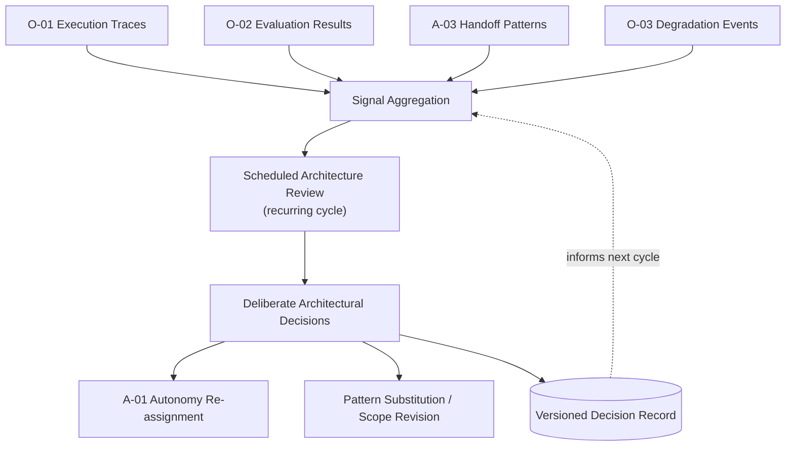

# E-02 — AI Architecture Evolution Loop

## Intent

Turn operational and evaluation signal into deliberate architectural change on a recurring cycle — revisiting autonomy-level assignments, pattern choices, and Envelope scopes as evidence accumulates — rather than allowing an AI-native architecture to drift through uncoordinated, ad hoc changes made in response to individual incidents or requests.

## Context

Every other pattern in this framework produces signal over time: `O-01` execution traces, `O-02` evaluation results, `A-03` handoff-reason patterns, `O-03` degradation-event frequency. Individually, each of these signals is useful for its own local decision; collectively, they describe how well an organization's actual AI-native architecture decisions are holding up against reality.

## Problem

Without a deliberate evolution loop, architectural change happens reactively and locally — a single incident prompts a point fix, a single complaint prompts a scope change — with no mechanism for recognizing that a *pattern* of accumulated signal (repeated handoffs of the same type, a consistently underutilized autonomy level, evaluation scores that have been quietly declining) warrants a deliberate architectural reconsideration rather than another local patch. This is the specific failure of silent architectural drift the flagship AI Architecture Evolution Loop concept (see `framework/aqevon-ai-native-architecture.md`) is designed to prevent.

## Forces

- **Responsiveness vs. deliberateness** — reacting immediately to every signal risks thrashing; waiting too long to aggregate signal risks a known problem persisting unaddressed.
- **Signal volume vs. review capacity** — a mature AI-native architecture produces substantial operational signal; only a fraction can receive deliberate architectural review each cycle.
- **Local optimization vs. architectural coherence** — point fixes that look locally correct can accumulate into an architecture that no longer coheres with the framework's stated principles.

## Solution

Establish a recurring, scheduled review cycle — distinct from ad hoc incident response — that aggregates signal from execution traces, evaluation results, handoff patterns, and degradation events across an AI-native architecture's capabilities, and produces deliberate architectural decisions (autonomy-level re-assignment, pattern substitution, Envelope scope revision) as its output, with those decisions themselves recorded and versioned.

## Architecture

## Sequence / Behavior

1. On a defined recurring cadence, aggregate operational and evaluation signal across the AI-native architecture's capabilities — not per-incident, but as a deliberate review input.
2. Identify patterns in the aggregated signal that individual point fixes would not surface: consistently declining evaluation scores, recurring handoff reasons, autonomy levels that measured confidence no longer supports (or now supports better than assigned).
3. Produce explicit architectural decisions in response — which may include revising an `A-01` autonomy-level assignment, substituting or reconfiguring a pattern, or narrowing/widening an `A-02` Envelope — and record the decision and its rationale.
4. Feed the decision record into the next cycle's context, so evolution is cumulative and traceable rather than a series of disconnected changes.

## When to Use

- Any AI-native architecture mature enough to be producing meaningful operational and evaluation signal — typically once a capability has been in production long enough for `O-01`/`O-02` data to be representative.

## When NOT to Use

- Newly deployed capabilities with insufficient operational history to produce meaningful aggregate signal — early-stage capabilities are better served by direct iteration than a formal review cycle, though they should be brought into the loop once sufficient signal accumulates.

## Benefits

- Converts accumulated operational evidence into deliberate, coherent architectural decisions rather than allowing it to either go unused or drive uncoordinated point fixes.
- Provides the mechanism by which an organization's AI-native architecture actually matures over time, rather than staying frozen at its initial design or drifting incoherently.

## Trade-offs

- Requires sustained organizational discipline to run the review cycle consistently, not just when convenient or when triggered by an incident.
- Aggregating and reviewing signal across a growing AI-native architecture is itself a scaling challenge as the number of capabilities grows.

## Security Considerations

Architectural decisions that widen scope or autonomy (in response to positive signal) should be held to the same rigor as the original assignment — positive aggregate signal is evidence, not a blanket license to relax `C-02` policy or `A-02` Envelope boundaries without deliberate re-justification.

## Governance Considerations

This loop is the primary mechanism connecting the framework's static assessment/maturity model (`assessment/`) to actual, ongoing architectural practice — a maturity assessment taken once and never revisited is itself a symptom of this loop not functioning.

## Reliability Considerations

A review cycle that never actually changes anything (decisions reviewed but not acted upon) is functionally equivalent to not having the loop at all, while consuming review capacity — cycle effectiveness should itself be tracked.

## Observability Considerations

The decision record produced by each cycle is itself a first-class artifact that should be queryable — "why is this capability currently scoped/assigned the way it is" should be answerable by reference to the evolution loop's decision history, not only the original design rationale.

## Related Patterns

`O-01` (AI Execution Trace — primary signal source), `O-02` (AI Evaluation Gate — primary quality signal source), `E-01` (Knowledge Evolution Loop — the knowledge-specific analog of this broader architectural evolution concept).

## Dependencies

Requires `O-01` and `O-02` to already be functioning and producing representative signal — this pattern aggregates and acts on their output, and cannot substitute for their absence.

## Anti-Patterns

None directly named in the current anti-pattern set; the general failure this pattern prevents — uncoordinated architectural drift via point fixes — cuts across several anti-patterns (`AP-06` privilege creep in particular is one concrete way drift manifests) rather than mapping to a single one.

## Known Uses / Evidence

Retrospective and architecture-review cycles are established practice in software engineering organizations generally (architecture review boards, quarterly technical retrospectives). AQEVON's contribution is defining a review loop specifically structured around the signal types this framework's other patterns produce (execution traces, evaluation results, handoff patterns, degradation events) as a coherent, AI-native-specific architectural governance mechanism, rather than a generic engineering retrospective. This is a proposed synthesis; it has not yet been validated against how, or whether, organizations currently practicing AI governance run an equivalent structured loop. Classified `P` — evidence required.

## Vendor Mappings

Vendor-neutral; this is an organizational/process pattern rather than a technology-specific one, though its signal sources (`O-01`, `O-02`) depend on the observability tooling in place.

## Research Questions

- What cadence is appropriate for different sizes/maturities of AI-native architecture — is a single organization-wide cadence realistic, or does this need to vary by capability risk tier?
- How should this loop's own effectiveness be measured, given that its output is architectural decisions rather than a directly measurable production metric?

## Revision History

- 0.1.0 (2026-08-24) — Initial pattern card. Classification hypothesis: P.
