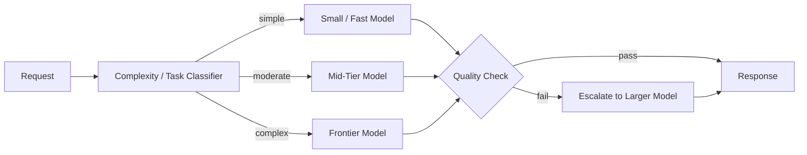

# I-01 — Model Routing

## Intent

Direct a given request to the most appropriate model — by capability, cost, latency, and task complexity — rather than sending every request to a single, uniformly-sized model.

## Context

An AI-native system serves requests of varying complexity: simple classification or extraction tasks, moderate reasoning tasks, and genuinely hard multi-step reasoning tasks. Model providers offer a range of models with different capability, cost, and latency profiles.

## Problem

Sending every request to the largest/most capable available model wastes cost and latency budget on requests that a smaller, cheaper, faster model would have handled correctly. Sending every request to a smaller model risks quality failures on the subset of requests that genuinely need stronger reasoning. Neither uniform choice is architecturally sound at scale.

## Forces

- **Cost vs. quality** — larger models cost more per request; the question is where the marginal quality gain stops justifying the marginal cost.
- **Latency budget** — some capabilities have hard latency requirements that rule out slower, larger models regardless of quality benefit.
- **Routing accuracy** — the router itself must correctly classify task complexity, which is a non-trivial prediction problem with its own failure modes.
- **Vendor diversity** — routing across multiple providers, not just multiple models from one provider, adds resilience (see `AP-07`) but adds integration complexity.

## Solution

Introduce an explicit routing layer between the request and model invocation that classifies the request (by complexity, task type, and/or a lightweight pre-check) and selects a model accordingly, with defined fallback behavior if the selected model fails or underperforms.

## Architecture

## Sequence / Behavior

1. A request arrives at the routing layer.
2. The classifier estimates task complexity and/or type, using heuristics, a lightweight model, or explicit request metadata.
3. The router selects a target model based on the classification, current cost/latency policy, and model availability.
4. Optionally, a post-hoc quality check (see `O-02`) evaluates whether the selected model's response was adequate; if not, the request escalates to a stronger model.
5. Routing decisions and their outcomes are logged for the model-selection policy to be tuned over time (see `E-02`).

## When to Use

- Any system with meaningful variance in request complexity and a real cost or latency constraint.
- Systems that need resilience against a single model provider's outage or deprecation (see `AP-07`).

## When NOT to Use

- Low-volume systems where routing engineering overhead exceeds any realistic cost/latency savings.
- Systems where every request genuinely requires the same, narrow capability profile — routing adds complexity with no corresponding benefit.

## Benefits

- Reduces average cost and latency without sacrificing quality on genuinely hard requests.
- Provides a natural point to add multi-provider resilience.

## Trade-offs

- The classifier is an additional component that can itself fail or misclassify, and must be evaluated and monitored like any other model-backed decision.
- Adds architectural and operational complexity relative to a single-model integration.

## Security Considerations

Ensure routing decisions do not inadvertently send sensitive content to a model/provider with a different data-handling agreement than the default — routing policy must be aware of data classification, not only task complexity.

## Governance Considerations

Maintain an explicit, reviewable routing policy (which task types go to which models, and why) rather than an opaque, purely learned routing function that cannot be explained during an audit.

## Reliability Considerations

Define explicit fallback behavior when a preferred model is unavailable (see `O-03`) — routing should improve resilience, not introduce a new single point of failure at the classifier itself.

## Observability Considerations

Log the routing decision, the model actually used, and the outcome for every request — this is essential input to `O-02` (AI Evaluation Gate) and to tuning the routing policy over time.

## Related Patterns

`I-02` (Context Budgeting), `O-02` (AI Evaluation Gate), `O-03` (Graceful AI Degradation).

## Dependencies

Requires access to multiple models with meaningfully different cost/capability/latency profiles; provides limited value with only one available model.

## Anti-Patterns

`AP-07` (Single-Model Dependency — the condition this pattern directly addresses).

## Known Uses / Evidence

Model routing (sometimes called "model cascading" or "mixture of experts at the API level") is widely documented and implemented across major AI platforms and is established industry practice. This pattern card documents it within AQEVON's meta-model rather than introducing a novel technique.

## Vendor Mappings

Most major cloud AI platforms (Azure AI, AWS Bedrock, Google Vertex AI) and several third-party gateways provide native or near-native routing capability; open-source routing layers are also widely available. See `RA-04` for detailed mapping.

## Research Questions

- What classifier architectures produce the best accuracy/cost trade-off for routing decisions themselves?
- How should routing policy adapt automatically based on `O-02` evaluation signal without requiring manual policy updates for every drift?

## Revision History

- 0.1.0 (2026-08-24) — Initial pattern card. Classification hypothesis: E.
