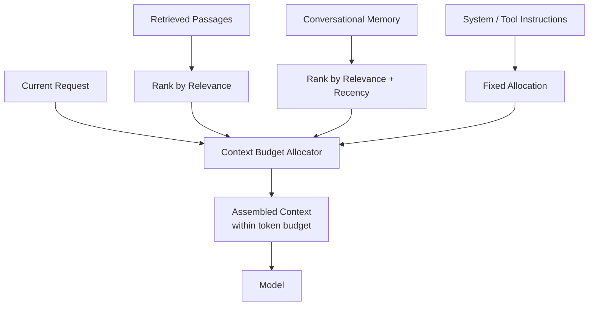

# I-02 — Context Budgeting

## Intent

Deliberately allocate and prioritize what enters a model's context window, treating context as a scarce, ranked resource — rather than appending retrieved passages, conversation history, and system instructions until the window is full.

## Context

A model's context window is finite, and every AI-native capability draws on several potential context sources simultaneously: retrieved knowledge (`K-01`), conversational memory (`I-03`), system/tool instructions, and the current request itself.

## Problem

The default, unengineered behavior is to concatenate all available context until the window limit is hit, in whatever order components happen to be assembled. This produces two failure modes: important information gets pushed out by less important information that happened to be assembled first, and models measurably attend less reliably to information buried in the middle of a long context ("lost in the middle" effects documented in model-evaluation research) — meaning position, not just presence, of information in context affects output quality.

## Forces

- **Completeness vs. precision** — including more potentially-relevant context increases the chance the right information is present, but dilutes the model's attention and increases cost.
- **Recency vs. relevance** — for conversational context, the most recent turns are not always the most relevant ones.
- **Cost vs. quality** — every token included has a direct cost; budgeting is partly a cost-control mechanism, not only a quality mechanism.

## Solution

Define an explicit context budget — a maximum token allocation, subdivided by category (retrieved knowledge, memory, instructions, current request) — and a ranking/selection process that decides what fills each category's allocation, rather than filling the window opportunistically.

## Architecture

## Sequence / Behavior

1. Each context source (retrieval, memory, instructions) is ranked independently by relevance to the current request.
2. The budget allocator assigns each source a maximum token allocation based on policy (which may vary by capability or request type).
3. Content is selected within each allocation, highest-ranked first, and assembled into the final context — with position within the assembled context also considered, given known attention effects.
4. The assembled, budgeted context is passed to the model.

## When to Use

- Any capability that draws on more than one context source simultaneously, especially where retrieved knowledge volume can vary significantly by query.
- Cost-sensitive systems at scale, where uncontrolled context growth is a direct cost driver.

## When NOT to Use

- Very simple, single-source, short-context interactions where the entire relevant context reliably fits well within budget regardless of allocation strategy.

## Benefits

- More reliable use of the most relevant available information.
- Predictable, controllable cost per request.

## Trade-offs

- Adds a ranking/allocation step with its own latency and potential for misranking.
- Requires ongoing tuning as model context-window sizes and attention characteristics change across model versions.

## Security Considerations

Ranking and selection logic must not become a mechanism that inadvertently prioritizes sensitive content into context when a lower-sensitivity, sufficient alternative exists — budget allocation should be aware of the same sensitivity classification used in `K-02`.

## Governance Considerations

Budget policy (how allocation is split across categories) should be documented and reviewable, not an emergent property of whichever engineer last tuned prompt assembly code.

## Reliability Considerations

Define fallback behavior when even the budgeted context is insufficient to answer — this should surface as an explicit "insufficient context" signal, not a degraded, ungrounded answer (see `K-01`).

## Observability Considerations

Log what was included, what was excluded, and why (rank score, budget exhaustion point) — this is necessary to diagnose cases where a correct answer existed in available knowledge but was excluded from context.

## Related Patterns

`K-01` (Grounded Retrieval), `I-03` (Governed Memory), `I-01` (Model Routing — budget policy may vary by routed model's context-window size).

## Dependencies

Requires a relevance-ranking mechanism for each context source; benefits from token-counting tooling specific to the target model.

## Anti-Patterns

`AP-05` (Context Dumping — the failure mode this pattern directly addresses).

## Known Uses / Evidence

The underlying phenomena (finite context windows, positional attention effects, the cost of unranked context inclusion) are documented in model-evaluation research and widely discussed in applied LLM engineering practice. AQEVON's contribution is framing deliberate, budgeted, ranked context assembly as a named architectural pattern with explicit governance and observability requirements, rather than an implementation detail left to prompt-engineering convention. Classified `S/P` — synthesis of established phenomena into an explicit pattern, with the specific ranked-allocation architecture proposed as AQEVON's formulation pending further validation.

## Vendor Mappings

Vendor-neutral; token-counting and context-assembly tooling varies by model provider and orchestration framework.

## Research Questions

- What ranking function generalizes best across capability types (Q&A, summarization, multi-step reasoning)?
- How should context budgets adapt automatically as model context-window sizes increase — does the problem this pattern solves diminish, or does it change shape (e.g., cost still bounds effective budget even as window size grows)?

## Revision History

- 0.1.0 (2026-08-24) — Initial pattern card. Classification hypothesis: S/P.
