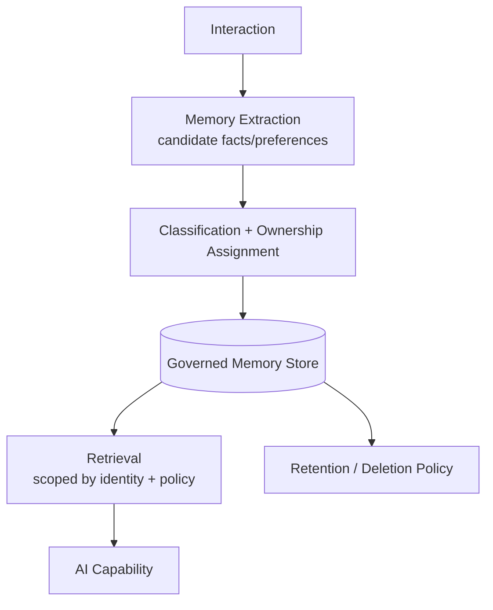

# I-03 — Governed Memory

## Intent

Store and retrieve persistent AI context — conversation history, user preferences, prior decisions — under the same access-control, provenance, and retention discipline as any other enterprise knowledge asset, rather than as an unmanaged, ad hoc accumulation of prior interactions.

## Context

AI-native capabilities increasingly persist context across sessions: a copilot remembers a user's prior questions, an agent remembers a prior decision it made on a related task, a support assistant remembers a customer's history. This persisted context is itself sensitive enterprise (or personal) data.

## Problem

Memory is frequently implemented as an unmanaged side effect — a growing log of prior interactions stored without classification, access control, retention policy, or the ability to correct or delete a specific memory. This creates compliance exposure (data the organization cannot account for), quality problems (stale or wrong prior context silently influencing new answers), and security exposure (memory built under one identity's session being retrievable by a different identity).

## Forces

- **Personalization value vs. governance cost** — memory improves relevance and reduces repeated user effort, but every persisted item carries ongoing governance obligations.
- **Retention vs. right-to-deletion** — regulatory and user-trust requirements (e.g., a user's right to have their data deleted) are in direct tension with the value of long-lived memory.
- **Staleness** — a memory that was correct when stored can become wrong (a preference changes, a fact becomes outdated) with no natural trigger to re-evaluate it.

## Solution

Treat memory as a governed knowledge type: every stored memory item carries an owner (typically the subject user or a service identity), a classification, a source/provenance record (what interaction produced it), and a retention policy. Memory retrieval is subject to the same authorization boundary as any other knowledge retrieval (`C-01`), and memory write is itself a logged, auditable action.

## Architecture

## Sequence / Behavior

1. An interaction produces candidate memory items (explicit user statements, inferred preferences, decisions made).
2. Each candidate is classified and assigned ownership and a retention policy before being persisted — not persisted first and classified later.
3. At retrieval time, memory is fetched subject to the same authorization check as any `K-02`-governed knowledge source.
4. Retention policy is enforced on a schedule, and explicit deletion requests are honored as first-class operations, not exceptions requiring manual intervention.

## When to Use

- Any capability that persists user- or entity-specific context across sessions.
- Any system operating under a regulatory regime with data-subject rights (deletion, access, correction) that would otherwise be unenforceable against an unmanaged memory store.

## When NOT to Use

- Stateless, single-session capabilities with no cross-session persistence requirement — introducing a governed memory layer here adds cost with no corresponding need.

## Benefits

- Memory becomes an auditable, correctable, deletable asset rather than an opaque accumulation.
- Reduces the risk of one identity's context leaking into another identity's session.

## Trade-offs

- Adds classification and governance overhead to every memory write, which can add latency to interactions that would otherwise feel instantaneous.
- Retention and deletion enforcement requires ongoing operational discipline, not a one-time implementation.

## Security Considerations

Memory retrieval must be scoped exactly as strictly as retrieval from any other knowledge source — a common failure mode is treating "the system's own memory" as implicitly trusted and therefore exempt from the authorization checks applied to external sources.

## Governance Considerations

Every memory item's provenance (which interaction produced it) must be retained so that a user or auditor can trace why the system "knows" a specific fact about them, and so incorrect memories can be traced back to their origin and corrected at the source.

## Reliability Considerations

Stale memory should have a defined freshness/expiry policy or a re-verification mechanism — memory that silently influences answers indefinitely, regardless of whether the underlying fact is still true, is a reliability risk, not just a governance one.

## Observability Considerations

Log memory writes and reads with the same rigor as any other data access (`O-01`) — this is what makes it possible to answer "what did the system know about this user, and when" during an investigation.

## Related Patterns

`K-02` (Enterprise Knowledge Fabric — memory is a knowledge type that should be governed consistently with it), `C-01` (Human Authorization Boundary), `C-03` (Identity-Carrying Agent).

## Dependencies

Requires a classification and ownership-assignment mechanism at write time, and integration with the enterprise identity provider for retrieval-time authorization.

## Anti-Patterns

`AP-05` (Context Dumping — unmanaged memory is a specific instance of this broader anti-pattern, applied to persisted rather than retrieved context).

## Known Uses / Evidence

Long-term memory for conversational AI systems is an active area of both research and applied product development across the industry; the specific mechanics (extraction, vector/graph storage of memories) are increasingly established. AQEVON's contribution — and the reason this pattern is classified `P` rather than `S` — is the explicit requirement that memory be governed with the same rigor as any other enterprise knowledge asset (ownership, retention, deletion, provenance) from the point of write, which is not yet consistently established practice in current memory-system implementations reviewed at the time of writing. Evidence required to confirm whether this governance-first framing already exists as named prior art elsewhere.

## Vendor Mappings

Vendor-neutral; several AI platform vendors offer native memory features with varying degrees of governance capability — implementation-specific gap analysis is documented in `RA-02`.

## Research Questions

- What is the right default retention period for different memory categories (explicit preference vs. inferred fact vs. transactional history)?
- How should governed memory interact with model fine-tuning or distillation pipelines that might otherwise absorb memory content in an ungoverned way?

## Revision History

- 0.1.0 (2026-08-24) — Initial pattern card. Classification hypothesis: P.
