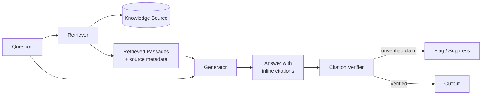

# K-01 — Grounded Retrieval

## Intent

Ensure every AI-generated claim in a response is traceable to a specific retrieved source, so a reader (or an auditor) can verify what the system actually knew when it produced that claim, rather than trusting an unverifiable assertion from model memory.

## Context

A system needs to answer questions or generate content using enterprise knowledge, and the correctness of that output has consequences — a wrong answer damages trust, creates compliance exposure, or leads to a bad decision. This is the foundational pattern beneath almost every enterprise RAG (retrieval-augmented generation) implementation, whether or not it is implemented well.

## Problem

Large language models generate fluent, confident-sounding text regardless of whether the underlying claim is true. Left unconstrained, a model will answer from its training-data memory — which may be outdated, generic, or simply wrong for the enterprise's specific context — with the same fluency as it would answer from genuinely retrieved, current, source-grounded information. The reader cannot tell the difference without independent verification, which defeats the purpose of using the system for authoritative answers.

## Forces

- **Fluency vs. verifiability** — grounded answers are often less fluent (more caveats, explicit citations) than ungrounded ones, which can read as less confident even when they are more trustworthy.
- **Coverage vs. precision** — broader retrieval increases the chance of finding a relevant source but also increases the chance of retrieving irrelevant content that dilutes grounding.
- **Latency vs. thoroughness** — retrieval and citation-verification add latency that must be budgeted against user experience requirements.
- **Model behavior is not fully controllable** — even with retrieved context supplied, a model may still blend in unretrieved "memory" content unless the generation step is explicitly constrained.

## Solution

Require that every substantive claim in a generated response be attributable to a specific passage retrieved at generation time, and make that attribution visible (inline citation, source list, or both). Where a claim cannot be grounded in retrieved content, the system must say so explicitly rather than filling the gap from model memory.

## Architecture

The Citation Verifier stage — checking, after generation, that each claim actually maps to a retrieved passage — is what distinguishes disciplined Grounded Retrieval from "RAG in name only," where retrieved context is supplied to the model but nothing enforces that the output actually used it.

## Sequence / Behavior

1. A question or generation request arrives.
2. The retriever queries the knowledge source(s) and returns passages with source metadata (document ID, location, timestamp).
3. The generator produces a response using only the retrieved passages as its factual basis, with explicit citation markers.
4. A verification step checks that cited claims are actually supported by the passage cited (not just topically related).
5. Unsupported claims are flagged, suppressed, or trigger a re-generation/refusal, depending on the system's risk tolerance.

## When to Use

- Any system where factual accuracy is a requirement, not a nice-to-have — compliance answers, customer-facing support, internal decision support.
- Any system operating in a regulated context where the source of a claim must be auditable after the fact.

## When NOT to Use

- Creative or exploratory generation tasks where grounding to a specific source is not the point (brainstorming, drafting, ideation).
- Cases where the answer genuinely requires synthesis beyond what any single source states — grounding should not be used to force citation of a claim that is a reasonable inference, provided that inference is itself clearly labeled as such.

## Benefits

- Verifiable output — a human or downstream system can check the citation.
- Reduces (but does not eliminate) hallucination risk, specifically the risk of confidently-stated false claims.
- Supports compliance and audit requirements that unstructured LLM output cannot meet on its own.

## Trade-offs

- Added latency and cost from the citation-verification step.
- Grounding can produce overly hedged answers if applied indiscriminately to low-stakes queries.
- Grounding quality is only as good as retrieval quality — see anti-pattern `AP-04` for the most common root cause of poor retrieval quality in enterprise deployments.

## Security Considerations

Citation must not leak content the requesting identity is not authorized to see — grounding a claim in a source the user cannot access is itself a disclosure risk. Retrieval must be scoped by the same authorization boundary as direct access to the source (see `C-01`).

## Governance Considerations

Cited sources should carry provenance metadata (owner, classification, last-verified date) so that grounded answers inherit the governance posture of their source, not a generic "AI-generated" label that obscures where the information actually came from.

## Reliability Considerations

Define explicit behavior for the "no relevant source found" case — the system must be able to say "I don't have a grounded answer for this" rather than falling back to ungrounded generation, which silently reintroduces the exact risk this pattern exists to prevent.

## Observability Considerations

Log the retrieved passages, the citations produced, and the verification result for every response — this is the evidentiary record needed for `O-01` (AI Execution Trace) and for post-hoc quality review.

## Related Patterns

`K-02` (Enterprise Knowledge Fabric — the governed source Grounded Retrieval draws from), `I-03` (Governed Memory — retrieved conversational context should be grounded the same way), `O-01` (AI Execution Trace).

## Dependencies

Requires a retrieval mechanism with source-level metadata (not just raw text chunks) and, ideally, a claim-verification step distinct from the generation step itself.

## Anti-Patterns

`AP-02` (RAG Everything — applying retrieval where a deterministic lookup would be more reliable), `AP-05` (Context Dumping — supplying large amounts of retrieved context without curation, which degrades grounding precision).

## Known Uses / Evidence

Grounded retrieval / RAG with citation is widely documented industry practice (established, not an AQEVON contribution) — see vendor RAG reference architectures from major cloud providers and the broader retrieval-augmented generation research literature. AQEVON's contribution in this pattern card is framing verification as a required, explicit architectural stage rather than an implementation detail, and connecting it to the Enterprise Knowledge Fabric's provenance model.

## Vendor Mappings

Vendor-neutral at the conceptual level. Implementation guidance (retrieval services, citation tooling) is documented in the corresponding reference architecture, `RA-01`.

## Research Questions

- What is the most reliable, cost-effective mechanism for automated claim-to-citation verification at scale (entailment models, structured extraction, human sampling)?
- How should grounded retrieval degrade gracefully under retrieval-source outage — see `O-03`.

## Revision History

- 0.1.0 (2026-08-24) — Initial pattern card. Classification hypothesis: E (Established).
