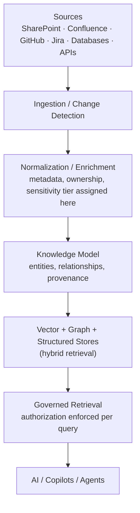

# K-02 — Enterprise Knowledge Fabric

## Intent

Provide a governed logical knowledge layer spanning documents, structured data, applications, APIs, engineering systems, entities, relationships, provenance, permissions, and freshness — so that AI capabilities across an enterprise consume knowledge through one governed layer instead of each building its own disconnected index.

## Context

An enterprise has knowledge fragmented across a dozen or more systems — SharePoint, Confluence, source-code repositories, issue trackers, CRMs, databases, internal APIs — each with different permission models, formats, and freshness characteristics. Multiple AI capabilities (a support copilot, an internal search assistant, an analytics agent) each need access to overlapping subsets of this knowledge.

## Problem

The default failure mode is that each AI initiative builds its own point-solution retrieval index against one or two sources. This works until a second, third, and fourth source need the same treatment — at which point the organization has N disconnected indexes, N different (and often inconsistent) authorization implementations, N freshness/staleness profiles, and no single place to reason about what an AI system as a whole actually knows and is allowed to know. See anti-pattern `AP-04` for the specific, common failure of conflating a vector database with this entire layer.

## Forces

- **Centralization vs. source-system autonomy** — a governed fabric must not become a second, ungoverned copy of the enterprise's information; source systems must remain systems of record.
- **Freshness vs. cost** — more frequent re-indexing reduces staleness but increases ingestion and compute cost.
- **Uniform access vs. heterogeneous authorization** — different source systems have genuinely different, non-interchangeable permission models that the fabric must reconcile, not flatten.
- **Retrieval technique diversity** — pure vector similarity search under-performs on exact-match (ticket IDs, policy numbers) and relationship-heavy (org hierarchy, dependency chains) queries; a single retrieval technique cannot serve all query types well.

## Solution

Traditional RAG treats retrieval as a single step: `Question → Retrieve chunks → Generate`. The Enterprise Knowledge Fabric treats retrieval as the output of a governed pipeline:

```
Enterprise Sources
  → Ingestion / Change Detection
  → Normalization / Enrichment
  → Knowledge Model
  → Vector + Graph + Structured Stores
  → Governed Retrieval
  → AI / Copilots / Agents
```

Each stage exists to close a specific gap the single-step model leaves open — see `framework/aqevon-ai-native-architecture.md` for the full per-stage rationale. The critical architectural decision is that metadata, ownership, and sensitivity classification are established **before** indexing, not after — this single design choice determines whether the fabric can enforce authorization at retrieval time (see `C-01`) or only after the fact.

## Architecture



## Sequence / Behavior

1. Source connectors detect new or changed content via incremental sync (change-data-capture or webhooks) where the source supports it, rather than full re-crawl by default.
2. Every item is assigned an owner, sensitivity tier, and freshness timestamp before indexing.
3. Content is normalized and enriched: chunking, entity extraction, and structure normalization tuned per source type.
4. The knowledge model captures entities and relationships, not just isolated text.
5. Content lands in hybrid stores — lexical, vector, and graph as appropriate to the content and expected query types.
6. At query time, retrieval is filtered by the requesting identity's actual entitlements, sourced from the enterprise identity provider, not a static "public index" filtered after the fact.

## When to Use

- Any enterprise with more than two or three distinct knowledge sources feeding, or expected to feed, more than one AI capability.
- Any context where retrieval must respect source-system-level authorization (i.e., almost all enterprise contexts).

## When NOT to Use

- A single, narrowly scoped AI feature drawing from one already-well-governed source with no near-term plan to add more sources — building the full fabric for this case is premature architecture. Start with `K-01` Grounded Retrieval directly against that one source.

## Benefits

- One governed layer instead of N disconnected, inconsistently secured indexes.
- Retrieval quality improves for exact-match and relationship-heavy queries that pure vector search under-serves.
- New AI capabilities can be built against the fabric without re-solving authorization and freshness from scratch.

## Trade-offs

- Meaningfully higher upfront architectural investment than a single point-solution index.
- Requires genuine cross-team coordination (source-system owners, security, the AI/platform team) that a point solution can avoid, at least initially.
- Cost is dominated by ingestion and re-indexing frequency, not query volume — a common budgeting mistake is sizing this like a query-cost problem when it is a pipeline-cost problem.

## Security Considerations

The most common failure mode this pattern is designed against: a system that authenticates the user correctly but retrieves from an index with no document-level authorization, surfacing content the user should not see. Authorization must be a retrieval-layer concern, enforced per query against the requesting identity's real entitlements — never a filter applied to a pre-computed "safe" result set.

## Governance Considerations

Access-revocation at a source system must propagate to the fabric, not just block future ingestion of already-indexed content — a stale index that still serves de-authorized content is a governance failure even if authorization is enforced correctly for new content.

## Reliability Considerations

Source-system rate limits and ingestion pipeline failures must not silently produce stale-but-undetected content; freshness SLAs per source should be explicit and monitored.

## Observability Considerations

Separate query, retrieval, and authorization signals into distinct, correlatable log streams (see `O-01`) — this is what makes it possible to detect and investigate an authorization-leak incident after the fact, rather than only being able to observe that "an answer was given."

## Related Patterns

`K-01` (Grounded Retrieval — the fabric is what Grounded Retrieval draws from), `K-03` (Knowledge Federation — an alternative for cases where centralization is not feasible), `C-01` (Human Authorization Boundary), `O-01` (AI Execution Trace).

## Dependencies

Requires enterprise identity infrastructure the fabric can query for real-time entitlement checks, and cooperating source-system owners willing to expose change-detection mechanisms.

## Anti-Patterns

`AP-04` (Vector Database as Knowledge Architecture — the single most common misapplication of this pattern's name to a subset of its actual scope), `AP-02` (RAG Everything).

## Known Uses / Evidence

The individual techniques within this pattern (hybrid retrieval, metadata-first indexing, identity-aware retrieval) are documented, established practice across major cloud providers' RAG reference architectures and enterprise search literature. AQEVON's contribution is the explicit framing of these techniques as one coherent "fabric" layer — distinct from and broader than a vector database — with the specific architectural sequencing (metadata before indexing) treated as the governing design decision. This synthesis has not been independently validated against a named, equivalent industry framework at the time of writing; classified `S/P` pending further prior-art review (see `research/prior-art-differentiation-matrix.md`). AQEVON has developed and published a corresponding reference architecture presentation (`RA-01`) as an illustrative reference architecture, not a claimed production customer implementation.

## Vendor Mappings

Vendor-neutral at the conceptual level; see `reference-architectures/RA-01-enterprise-knowledge-fabric.md` for Azure, AWS, GCP, and open-source implementation mapping.

## Research Questions

- What is the right default granularity for sensitivity-tier classification (per-document vs. per-chunk vs. per-field)?
- How should the fabric's knowledge model represent relationships that span source-system boundaries without creating a shadow system of record?
- Is there existing, named prior art for this exact "sources → governed fabric → AI consumers" framing that should shift this pattern's classification toward `S` (Synthesized) or even `E` (Established)? Evidence required.

## Revision History

- 0.1.0 (2026-08-24) — Initial pattern card. Classification hypothesis: S/P.
