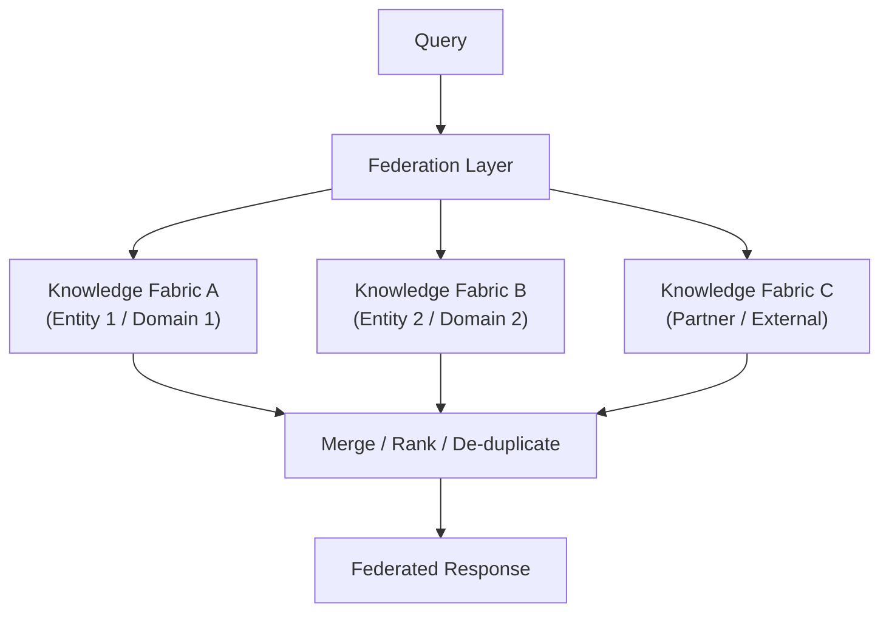

# K-03 — Knowledge Federation

## Intent

Query and reconcile knowledge across multiple, independently governed knowledge sources or fabrics at request time, without requiring full centralization into a single indexed store.

## Context

Some enterprises — post-merger organizations, regulated multi-entity structures, or ecosystems that include external partner knowledge — have knowledge domains that cannot or should not be centralized into one `K-02` Enterprise Knowledge Fabric, whether for regulatory, organizational, or trust-boundary reasons.

## Problem

`K-02` assumes a single governed fabric is achievable. In practice, some knowledge domains are governed by different legal entities, subject to different regulatory regimes, or owned by organizations unwilling to cede indexing control to a shared platform. Forcing centralization in these cases either fails politically/legally or produces a fabric that quietly excludes exactly the knowledge domains hardest to reason about.

## Forces

- **Consistency vs. sovereignty** — a fully centralized fabric gives the most consistent retrieval experience but requires every source owner to cede control; federation preserves sovereignty at the cost of consistency and added query-time complexity.
- **Latency** — federated queries that fan out to multiple independently-hosted knowledge fabrics are slower than querying one centralized store.
- **Cross-domain identity mapping** — a user's entitlements may be expressed differently across federated domains, requiring a reconciliation layer.

## Solution

Rather than one physical fabric, define a federation layer that queries multiple independently governed knowledge fabrics (each internally structured per `K-02`) at request time, merges and ranks results, and reconciles the requesting identity's entitlements against each domain's own authorization model.

## Architecture

## Sequence / Behavior

1. A query arrives at the federation layer along with the requesting identity's context.
2. The federation layer determines which member fabrics are relevant and permitted for this query and identity.
3. Each relevant fabric is queried independently, using its own internal `K-02` governed-retrieval mechanics.
4. Results are merged, de-duplicated, and ranked; provenance (which fabric each result came from) is preserved, not discarded.
5. The federated response is returned with per-item provenance intact, so grounding (`K-01`) can still cite the true originating source.

## When to Use

- Post-merger integration where source organizations' knowledge cannot yet (or should not) be merged into one physical index.
- Regulated multi-entity enterprises where cross-entity data residency or governance rules prohibit centralization.
- Ecosystems that need to reason over both internal and trusted external/partner knowledge without absorbing the partner's data into internal systems.

## When NOT to Use

- When centralization is organizationally and legally feasible — federation is strictly more complex and slower than a single `K-02` fabric, and should not be chosen by default.

## Benefits

- Preserves source-domain sovereignty and existing governance investment.
- Enables cross-domain knowledge queries without a disruptive, high-risk centralization program.

## Trade-offs

- Higher query-time latency than a centralized fabric.
- Result ranking across heterogeneous domains is inherently harder to tune consistently than ranking within one store.
- Requires an identity-reconciliation mechanism across domains, which is itself non-trivial architecture.

## Security Considerations

Each federated domain's authorization model must be respected independently — the federation layer must not become a mechanism for bypassing one domain's access controls by combining it with looser controls from another.

## Governance Considerations

Provenance must survive the merge step; a federated result that loses its originating-domain attribution undermines both grounding (`K-01`) and any domain-specific compliance requirement tied to that source.

## Reliability Considerations

The federation layer must define explicit behavior for partial failure — one member fabric being unavailable should degrade the response (see `O-03`), not fail the entire query.

## Observability Considerations

Log which member fabrics were queried, which responded, and which results were ultimately surfaced, per request — necessary both for debugging and for demonstrating domain-level access-control compliance.

## Related Patterns

`K-02` (Enterprise Knowledge Fabric — the unit being federated), `C-01` (Human Authorization Boundary — the cross-domain identity reconciliation concern).

## Dependencies

Requires each member domain to already implement `K-02`-style governed retrieval internally; federation does not substitute for domain-level governance, it composes domains that already have it.

## Anti-Patterns

`AP-04` (Vector Database as Knowledge Architecture — federation without governed member fabrics reduces to federating ungoverned indexes, which compounds rather than solves the underlying problem).

## Known Uses / Evidence

Data federation and federated query architectures are well-established in enterprise data-integration literature generally (established as a data-architecture concept). AQEVON's contribution is applying this established pattern specifically to AI-native knowledge retrieval across independently governed fabrics, with provenance preservation as an explicit requirement rather than an implementation detail. Evidence required for a directly equivalent, named AI-specific prior-art formulation.

## Vendor Mappings

Vendor-neutral. Federation-layer implementation may use data-virtualization platforms, API gateways, or purpose-built federation services depending on the underlying member-fabric technologies.

## Research Questions

- What ranking strategy best balances relevance and fairness across heterogeneous member fabrics with different retrieval characteristics?
- Should federation support write-back (updating a member fabric via the federation layer), or remain strictly read-oriented?

## Revision History

- 0.1.0 (2026-08-24) — Initial pattern card. Classification hypothesis: S.
