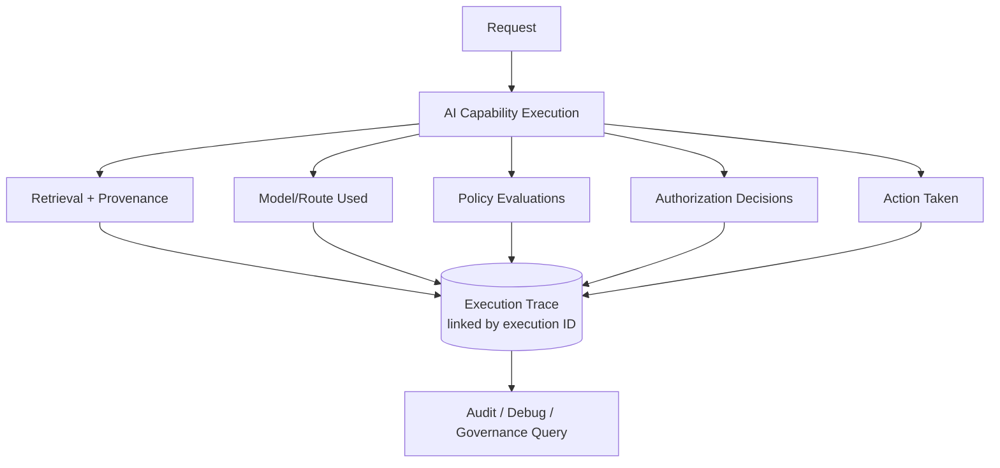

# O-01 — AI Execution Trace

## Intent

Capture a complete, queryable record of what an AI capability retrieved, reasoned, decided, and did for every execution, so that any individual outcome can be reconstructed and explained after the fact, not just aggregate system health.

## Context

Nearly every other pattern in this framework — grounded retrieval (`K-01`), bounded agents (`A-02`), policy-bounded action (`C-02`), identity-carrying agents (`C-03`), authorization boundaries (`C-01`) — produces events that only become useful for audit, debugging, and governance if they are captured in a structured, retrievable form.

## Problem

Conventional application logging is typically designed around system health (errors, latency, throughput) rather than around explaining a specific AI-generated outcome. When an AI capability produces a wrong, harmful, or disputed result, the common unengineered state of affairs is that no one can reconstruct what knowledge was retrieved, what the model reasoned, what policy was evaluated, or who the acting identity was — because this information was never captured as a coherent, linked record in the first place.

## Forces

- **Completeness vs. storage/performance cost** — capturing full retrieval content, full model reasoning, and full action detail for every execution has real storage and latency cost at scale.
- **Sensitive content in traces** — the trace itself may contain the same sensitive knowledge or personal data as the execution it describes, and must be governed accordingly.
- **Structured queryability vs. raw completeness** — a trace optimized purely for "capture everything" can become too unstructured to query effectively during an actual investigation.

## Solution

Define a structured execution trace schema covering, at minimum: the triggering request, the acting identity (`C-03`), knowledge retrieved and its provenance (`K-01`), model/route used (`I-01`), reasoning summary, policy evaluations and their outcomes (`C-02`), any human authorization decisions (`C-01`), and the final action taken — captured consistently for every execution and linked by a common execution ID.

## Architecture

## Sequence / Behavior

1. Assign a unique execution ID at the start of every AI capability invocation.
2. As execution proceeds through retrieval, reasoning, policy evaluation, authorization, and action, append each structured event to the trace under that execution ID.
3. Persist the completed trace under access controls and retention policy matching the sensitivity of its contents (which may equal or exceed the sensitivity of the underlying knowledge sources).
4. Expose the trace to structured query — by execution ID, by identity, by time range, by policy outcome — for audit, debugging, and governance use, not only raw log search.

## When to Use

- Any AI-native capability, without exception — this is treated as a baseline operational requirement, not an optional add-on for high-risk capabilities only.

## When NOT to Use

- N/A as a pattern to skip; the only variation is how much detail a given capability's trace needs to capture, not whether it is traced at all.

## Benefits

- Makes individual outcomes explainable and disputable — a specific answer or action can be reconstructed and reviewed, not just aggregate metrics.
- Is the direct enabling data source for `O-02` (evaluation), incident investigation, and governance review across nearly every other pattern in this framework.

## Trade-offs

- Adds storage and, if implemented synchronously, latency cost to every execution.
- The trace itself becomes a sensitive data asset requiring its own governance — an under-protected execution trace can leak the same sensitive information as the underlying knowledge and action it describes.

## Security Considerations

Execution traces frequently contain sensitive retrieved content, reasoning that references confidential information, and identity data — access to the trace store must be at least as tightly governed as the underlying knowledge sources it references.

## Governance Considerations

Trace retention policy must reconcile audit/compliance retention requirements with data-subject deletion rights (see `I-03` for the equivalent tension in governed memory) — these can be in direct conflict and require an explicit organizational decision, not a default.

## Reliability Considerations

Trace capture should be designed so that a trace-capture failure does not silently take down the underlying capability — but a capability operating with trace capture failing should itself be flagged, since it is operating without its primary audit mechanism.

## Observability Considerations

This pattern is itself the primary observability mechanism for the entire framework — nearly every other pattern's "Observability Considerations" section refers back to it.

## Related Patterns

`O-02` (AI Evaluation Gate — consumes trace data as evaluation input), `C-03` (Identity-Carrying Agent — supplies the identity field every trace entry requires), `C-01` (Human Authorization Boundary — authorization decisions are a required trace event type).

## Dependencies

Requires a structured logging/trace-storage infrastructure capable of linking multi-step, multi-component events under a common execution ID, and an access-control model applied to the trace store itself.

## Anti-Patterns

`AP-08` (Human-in-the-Loop Theater — undetectable without trace data showing approval patterns over time).

## Known Uses / Evidence

Distributed tracing (linking multi-service request execution under a common trace ID) is well-established practice in software observability generally. AQEVON's contribution is defining the specific schema and content requirements (retrieval provenance, policy evaluation outcomes, authorization decisions, acting identity) that make a trace useful specifically for AI-native accountability and audit, beyond generic distributed-systems tracing. Classified `S` — synthesis of an established observability practice applied to this domain's specific requirements.

## Vendor Mappings

Vendor-neutral; may be implemented atop general-purpose distributed tracing/observability platforms with an AI-specific schema layered on top, or purpose-built AI observability tooling. See `RA-04`.

## Research Questions

- What is the right default retention period balancing audit value against storage cost and data-minimization principles?
- How should trace schema standardize across an organization's AI portfolio without becoming so rigid it cannot capture capability-specific detail?

## Revision History

- 0.1.0 (2026-08-24) — Initial pattern card. Classification hypothesis: S.
