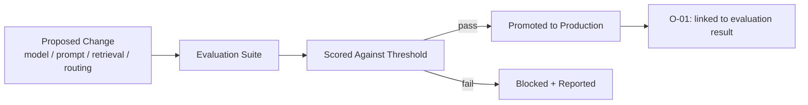

# O-02 — AI Evaluation Gate

## Intent

Require an AI capability to pass a defined evaluation threshold before a change — a new model version, a prompt change, a retrieval configuration change, a routing policy change — is promoted to production, rather than promoting changes on the basis of informal spot-checking or unqualified confidence.

## Context

AI capabilities change frequently and in ways traditional software does not: the underlying model may be updated by its provider, prompts are iterated, retrieval sources and ranking are tuned, and routing policy (`I-01`) is adjusted. Each of these changes can alter output quality in ways that are not obvious from a small number of manual test interactions.

## Problem

The common, unengineered default is to promote AI capability changes based on a handful of manually reviewed examples or general confidence that "it seems better," without a defined, repeatable evaluation process. This means quality regressions — including regressions specific to edge cases or subpopulations not covered by the manual spot-check — can reach production undetected, and the actual confidence level referenced by `A-01`'s autonomy-level justification becomes an assumption rather than a measurement.

## Forces

- **Evaluation rigor vs. iteration speed** — a thorough evaluation suite takes time to run and maintain, which is in tension with the pace of iteration AI capabilities often need.
- **Representative coverage vs. evaluation cost** — an evaluation set that genuinely represents production query/task diversity is expensive to build and keep current; a narrow or stale set gives false confidence.
- **Automated metrics vs. qualitative judgment** — some quality dimensions are amenable to automated scoring; others genuinely require human judgment, which is slower and more expensive.

## Solution

Define an evaluation suite — a representative set of test cases with defined success criteria — and a corresponding pass threshold that a proposed change must clear before promotion to production, with the evaluation results themselves recorded and linked to the specific change they gated.

## Architecture

## Sequence / Behavior

1. Maintain a representative evaluation suite for each AI capability, kept current with actual production query/task diversity (informed by `O-01` trace data).
2. Define a pass threshold appropriate to the capability's risk profile and assigned autonomy level (`A-01`) — higher-consequence capabilities warrant stricter thresholds.
3. Run the evaluation suite against any proposed change before promotion; block promotion on failure and report the specific failing cases.
4. Record the evaluation result and link it to the promoted change, so that production behavior can always be traced back to the evaluation that justified it.

## When to Use

- Any AI capability capable of being changed independently of a full application release (model version, prompt, retrieval configuration, routing policy) — which in practice is nearly all AI-native capabilities.

## When NOT to Use

- Extremely low-risk, easily reversible capabilities where the cost of building and maintaining an evaluation suite exceeds the realistic cost of an undetected regression — though this exemption should be an explicit, documented decision, not a default.

## Benefits

- Converts confidence in a capability's quality from an assumption into a measured, repeatable, auditable result.
- Directly supplies the "measured confidence" input the `A-01` autonomy-level assessment requires, rather than leaving it as an informal judgment.

## Trade-offs

- Building and maintaining a genuinely representative evaluation suite is ongoing work, not a one-time setup task.
- A poorly designed evaluation suite (unrepresentative, stale, or gamed by overfitting to it) provides false confidence that can be worse than no formal evaluation at all, since it is trusted more.

## Security Considerations

Evaluation results and thresholds should not be modifiable by the same process or role responsible for the change being evaluated, to preserve the integrity of the gate.

## Governance Considerations

Evaluation thresholds and results are a primary artifact for governance review of a capability's fitness for its assigned autonomy level — see `assessment/` for how this integrates into organizational maturity measurement.

## Reliability Considerations

Evaluation suite execution should itself be monitored — a silently broken or skipped evaluation run is functionally equivalent to having no gate at all, while appearing compliant.

## Observability Considerations

Every promoted change should be traceable to the specific evaluation run and result that justified its promotion (`O-01`), enabling later investigation if a promoted change turns out to underperform in production despite passing evaluation.

## Related Patterns

`O-01` (AI Execution Trace — supplies representative production data for evaluation suite maintenance, and records the promotion decision), `E-02` (AI Architecture Evolution Loop — evaluation results are a primary input signal), `I-01` (Model Routing — routing policy changes are a specific case requiring evaluation).

## Dependencies

Requires a maintained, representative evaluation suite and a defined, enforced promotion process that cannot be bypassed informally.

## Anti-Patterns

`AP-07` (Single-Model Dependency — an evaluation gate is one of the mechanisms that makes safe model-version changes and fallback routing possible in the first place).

## Known Uses / Evidence

Automated testing gates before production promotion are well-established practice in software engineering generally (CI/CD test suites, canary releases). AQEVON's contribution is applying this established discipline specifically to the categories of AI-native change (model version, prompt, retrieval configuration, routing policy) that traditional software test suites are not designed to evaluate. Classified `S` — synthesis of an established software delivery practice applied to AI-specific change types.

## Vendor Mappings

Vendor-neutral; evaluation tooling ranges from general-purpose LLM evaluation frameworks to purpose-built internal evaluation harnesses.

## Research Questions

- What evaluation suite maintenance cadence keeps representativeness current without becoming an unsustainable ongoing burden?
- How should automated metric-based evaluation and human qualitative evaluation be combined into a single pass/fail threshold decision?

## Revision History

- 0.1.0 (2026-08-24) — Initial pattern card. Classification hypothesis: S.
