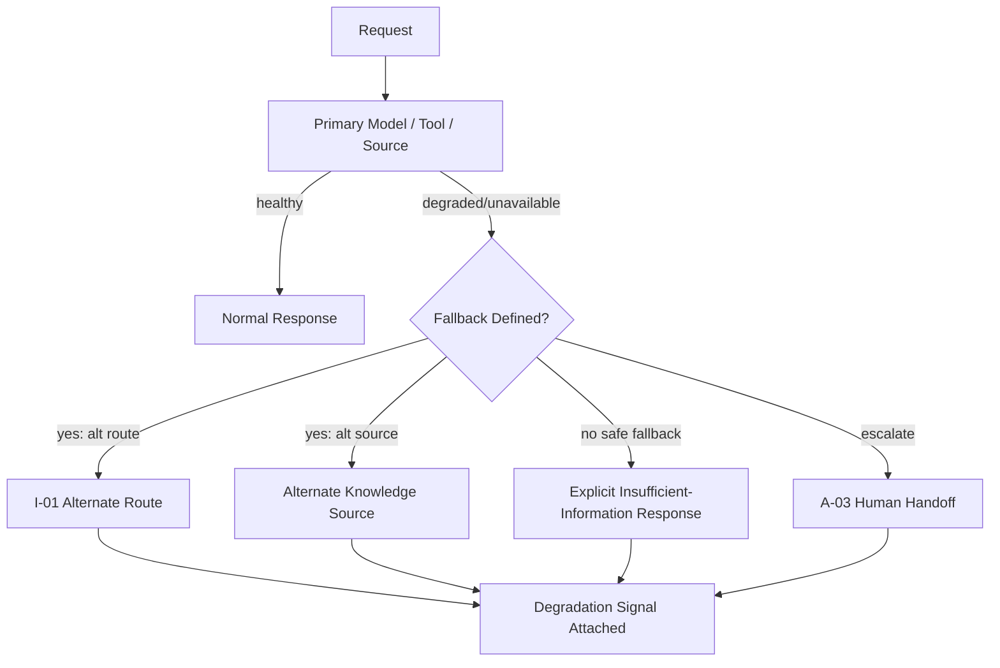

# O-03 — Graceful AI Degradation

## Intent

Define explicit fallback behavior for an AI capability when its primary model, tool, or knowledge source is unavailable or underperforming, so that failure produces a known, bounded degradation in service rather than an undefined or silently wrong result.

## Context

AI capabilities depend on external, sometimes third-party components — model provider APIs, knowledge retrieval systems, tool integrations — any of which can become unavailable, degraded in latency, or measurably lower quality (a model provider's own incident, a knowledge source going stale or offline) independent of the capability's own code.

## Problem

Without explicit degradation design, the default failure behavior is often either a hard failure with no useful response, or — worse — a "successful" response generated by a degraded component with no signal to the user or downstream system that quality may be compromised. The latter is particularly dangerous for capabilities depending on `K-01` (Grounded Retrieval), where a retrieval-source outage without defined fallback risks the model answering from unGrounded memory instead of surfacing an explicit "insufficient information" result.

## Forces

- **Availability vs. honesty about degraded quality** — keeping a capability "up" during a dependency failure is only good if the degraded response is clearly distinguishable from a normal one; otherwise availability comes at the cost of silent quality loss.
- **Fallback complexity vs. dependency surface** — the more dependencies a capability has, the more fallback paths must be designed and tested, which is nontrivial engineering investment.
- **Graceful degradation vs. false reassurance** — a fallback that is too smooth can mask a dependency failure that operationally should be getting attention.

## Solution

For each external dependency an AI capability relies on, define an explicit fallback behavior — an alternate model route (`I-01`), a cached or alternate knowledge source, an explicit "insufficient information, cannot proceed" response, or a routed handoff to a human (`A-03`) — selected deliberately per dependency rather than left as an unspecified failure mode, and always accompanied by a clear signal that degraded behavior is in effect.

## Architecture

## Sequence / Behavior

1. Enumerate each external dependency of the AI capability (model provider, knowledge source, tool/API).
2. For each, define a specific fallback: an alternate route, an alternate source, an explicit insufficiency response, or an escalation/handoff — chosen based on what preserves the most honesty about degraded quality.
3. Monitor dependency health and trigger the defined fallback automatically on detected degradation or unavailability.
4. Attach an explicit signal to any degraded response — visible to the user or downstream system, and recorded in the execution trace (`O-01`) — rather than presenting a degraded result indistinguishably from normal operation.

## When to Use

- Any AI capability with an external dependency whose failure or degradation would otherwise be undefined or silent — in practice, nearly all production AI-native capabilities.

## When NOT to Use

- Capabilities with no meaningful external dependency risk, or where a hard failure with a generic error is genuinely the correct and sufficient behavior (e.g., a purely internal, low-stakes experimental tool).

## Benefits

- Converts undefined failure behavior into a known, bounded, and honestly signaled degradation.
- Reduces the risk of the specific dangerous failure mode where a degraded component produces a confident-looking but lower-quality or unGrounded result.

## Trade-offs

- Requires upfront design and testing investment per dependency, which grows with the number of dependencies a capability has.
- Fallback paths that are rarely exercised in practice risk being untested and broken exactly when needed, unless explicitly included in evaluation (`O-02`) or chaos-testing practice.

## Security Considerations

Fallback paths (e.g., an alternate knowledge source) must be held to the same access-control and provenance discipline as the primary path — a fallback should never become a way to bypass governance controls under the guise of maintaining availability.

## Governance Considerations

The choice of fallback per dependency (especially "explicit insufficiency" vs. "alternate source") is a risk decision that should be documented and reviewable, not an incidental implementation detail.

## Reliability Considerations

This pattern is itself a core reliability mechanism — its absence is what makes dependency failures propagate as undefined or silently degraded behavior rather than bounded, known behavior.

## Observability Considerations

Degradation events — which dependency failed, which fallback was triggered, for how long — should be logged (`O-01`) and ideally alertable, since a fallback path being exercised frequently is itself a signal the primary dependency needs attention.

## Related Patterns

`I-01` (Model Routing — alternate routing is a common fallback mechanism), `O-01` (AI Execution Trace — records degradation events), `O-02` (AI Evaluation Gate — fallback paths should themselves be evaluated, not assumed correct).

## Dependencies

Requires dependency health monitoring and a routing/orchestration layer capable of switching to a defined fallback automatically.

## Anti-Patterns

`AP-07` (Single-Model Dependency — the specific failure this pattern is a direct corrective for, generalized beyond just model dependency to knowledge and tool dependencies as well).

## Known Uses / Evidence

Graceful degradation and circuit-breaker patterns are well-established in distributed-systems engineering generally. AQEVON's contribution is extending this established discipline to the AI-specific dependency types (model quality degradation, knowledge source staleness/unavailability) and the specific requirement that degraded AI responses be explicitly signaled rather than presented indistinguishably from normal output — a requirement not always present in general-purpose circuit-breaker practice. Classified `S/P` — synthesis of established distributed-systems practice, with the explicit-degradation-signaling requirement proposed as AQEVON's specific extension pending further validation.

## Vendor Mappings

Vendor-neutral; may be implemented via general-purpose circuit-breaker/resilience libraries combined with AI-specific fallback routing logic.

## Research Questions

- What is the right way to signal degraded quality to end users without creating alert fatigue or undermining trust in the capability generally?
- How should fallback paths be included in regular evaluation (`O-02`) without doubling evaluation suite maintenance burden?

## Revision History

- 0.1.0 (2026-08-24) — Initial pattern card. Classification hypothesis: S/P.
