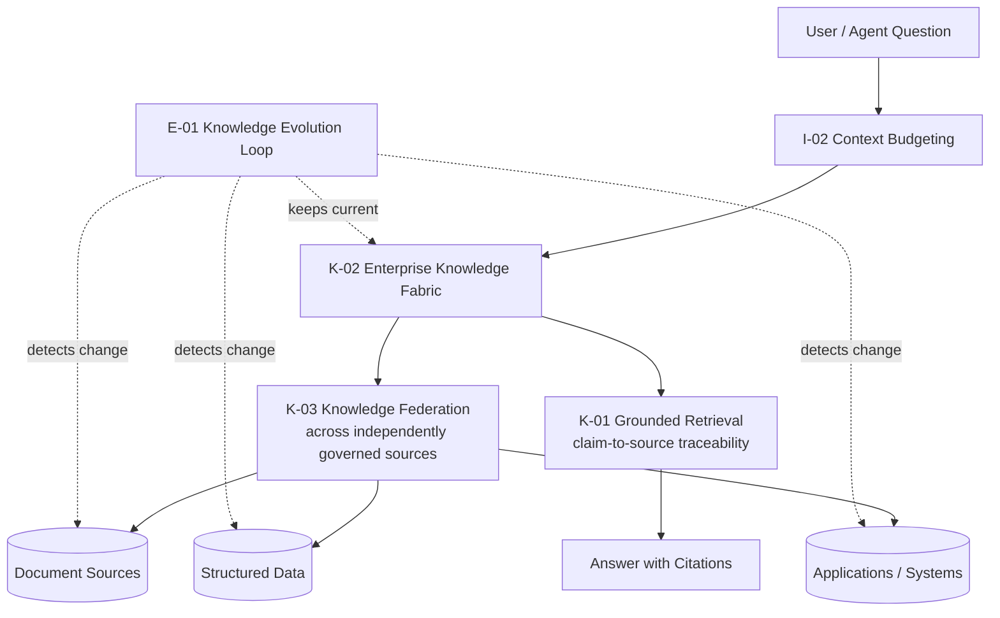

# RA-01 — Grounded Enterprise Knowledge Retrieval

## Scenario

An organization wants an AI capability — a Q&A assistant, a copilot, an agent's knowledge-lookup step — to answer questions using the organization's own knowledge, with answers that are accurate, current, properly access-controlled, and traceable back to their source. This is the most common starting scenario for enterprise AI-native architecture and the foundation nearly every other reference architecture in this set builds on.

## When This Architecture Fits

- Any capability whose primary value is answering questions or synthesizing information from documents, structured data, or systems the organization already has.
- Situations where trust and auditability of AI-generated claims matter — regulated industries, internal decision support, customer-facing answers with compliance exposure.
- Organizations with knowledge spread across multiple, independently governed sources rather than one clean, centralized repository.

## When It Doesn't Fit

- Purely generative tasks with no grounding requirement (creative writing, code generation from first principles) — `K-01`'s grounding overhead is unnecessary here.
- Single-source, small-scale knowledge needs where the full `K-02`/`K-03` fabric and federation apparatus would be substantial over-engineering relative to the actual source complexity — a simpler direct retrieval setup may suffice, with a documented decision to skip fabric-level abstraction.

## Architecture Overview

## Component Breakdown

- **Ingestion / federation layer** — connects to document sources, structured data, and applications without forcing centralization, per `K-03`.
- **Governed fabric layer** — the logical knowledge layer (`K-02`) that enforces access control and provenance consistently across all federated sources, regardless of each source's native capability.
- **Freshness loop** — `E-01` running continuously against every source, propagating change into the fabric.
- **Context assembly layer** — `I-02` ranks and budgets what retrieved content actually enters the model's context for a given question.
- **Grounding/answer layer** — `K-01` ensures every claim in the generated answer traces to a specific retrieved source, with citations surfaced to the end user or downstream system.

## Pattern Composition

| Pattern | Role in This Architecture |
|---|---|
| `K-02` | Provides the governed logical layer every other component in this architecture operates within — access control and provenance are enforced here, once, rather than per-source. |
| `K-03` | Allows the fabric to span multiple independently governed sources without forcing premature centralization. |
| `E-01` | Keeps the fabric's served content current as underlying sources change. |
| `I-02` | Ensures the highest-relevance retrieved content is what actually reaches the model, positioned effectively within budget. |
| `K-01` | Enforces that the final answer is traceable to specific retrieved sources, not asserted from model memory. |

## Data / Control Flow

1. A question enters the system (from a user or an upstream agent capability).
2. The fabric (`K-02`) resolves which federated sources (`K-03`) are relevant and authorized for the requesting identity.
3. Candidate content is retrieved, ranked, and budgeted (`I-02`) before assembly into context.
4. The model generates an answer constrained to only assert claims traceable to the assembled, retrieved content (`K-01`).
5. Independently and continuously, `E-01` monitors each federated source for change and propagates updates into what the fabric serves — this loop runs decoupled from any individual question/answer cycle.

## Integration Points and Seams

- **Identity propagation** — retrieval authorization depends on the querying identity being available at the fabric layer; this architecture assumes `C-03` (Identity-Carrying Agent) is in place upstream if the capability is agentic, or standard user authentication if not.
- **Trace integration** — every retrieval and grounding decision should feed `O-01` (AI Execution Trace) even though tracing itself is not a primary pattern of this reference architecture; RA-04 covers that composition in full.

## Deployment Considerations

- The federation layer (`K-03`) is typically the most organizationally, not just technically, complex component — it requires coordination across whichever teams own each source system, not just engineering effort.
- `E-01`'s change-detection cadence should be tuned per source based on actual source volatility, not a single global sync interval.

## Security & Governance Considerations

- Access control must be enforced at the fabric/retrieval layer (`K-02`), not only at the application layer after retrieval — this is the specific gap `AP-04` (Vector Database as Knowledge Architecture) names when skipped.
- Every source's classification and access policy must be preserved through federation (`K-03`) and through freshness updates (`E-01`) — a common failure point is losing this metadata during re-indexing.

## Known Limitations and Open Trade-offs

- Structured, exactly-answerable data (a specific field value) is better served by direct structured query than by this architecture's retrieval-and-generation path — see `AP-02` (RAG Everything). A production implementation of RA-01 typically includes a structured-query path alongside the grounded-retrieval path, routed by question type.
- Federation across many heterogeneous sources (`K-03`) has diminishing returns past a certain source count without proportional governance investment — this architecture does not eliminate that cost, it structures how it's paid.

## Vendor-Neutral Implementation Notes

Hybrid retrieval combining vector similarity search with graph-based relationship traversal is, as of this framework's August 2026 research pass, the dominant production pattern for the retrieval mechanics underlying `K-01`/`K-02` (see `research/sources.md`). This reference architecture is agnostic to that implementation choice — vector-only, graph-only, or hybrid retrieval can all sit beneath a properly governed `K-02` fabric layer.

## Related Reference Architectures

`RA-02` (Governed AI Memory — extends this architecture's governance discipline to persisted, per-user context rather than shared enterprise knowledge), `RA-05` (Composite Architecture — this reference architecture is typically the knowledge-domain slice of the full composite).

## Revision History

- 0.1.0 (2026-08-24) — Initial reference architecture.
