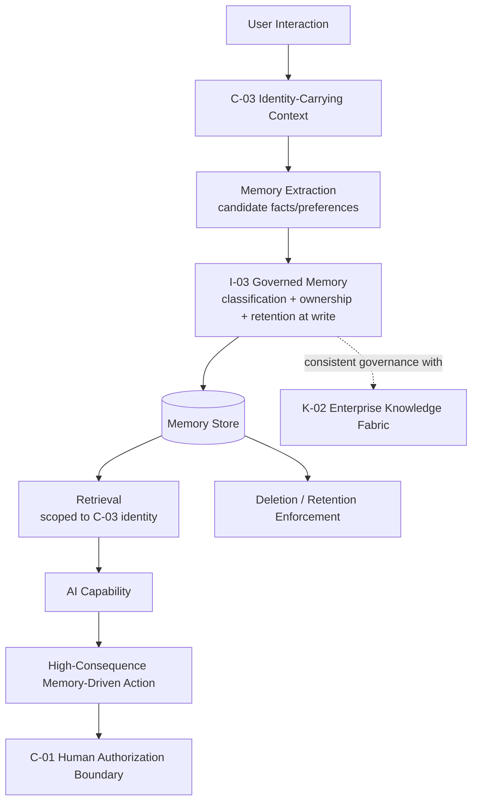

# RA-02 — Governed AI Memory & Personalization

## Scenario

A capability — a copilot, a support assistant, a personal productivity agent — needs to remember things about a specific user or entity across sessions to be genuinely useful: prior preferences, prior decisions, relevant history. This reference architecture defines how to do that without creating the compliance and quality exposure that unmanaged memory accumulation produces.

## When This Architecture Fits

- Any capability with a cross-session, per-user or per-entity persistence requirement.
- Organizations operating under regulatory regimes with data-subject rights (access, correction, deletion) that an unmanaged memory store cannot support.

## When It Doesn't Fit

- Stateless, single-session capabilities with no cross-session persistence need — introducing this architecture here is unjustified overhead.

## Architecture Overview

## Component Breakdown

- **Identity layer** — every interaction that produces or retrieves memory is bound to a specific, verifiable identity (`C-03`), not a shared session concept.
- **Extraction and classification layer** — candidate memory items are extracted, classified, and assigned ownership and retention policy at write time (`I-03`), not persisted first and governed later.
- **Retrieval layer** — memory retrieval is scoped by the requesting identity's own authorization, consistent with how `K-02` governs any other knowledge type.
- **Authorization layer** — any action taken on the basis of memory that crosses a defined consequence threshold routes through a `C-01` human authorization boundary rather than acting on stored memory unchecked.

## Pattern Composition

| Pattern | Role in This Architecture |
|---|---|
| `I-03` | Defines the write-time classification, ownership, and retention discipline that distinguishes this architecture from unmanaged memory accumulation. |
| `C-03` | Ensures every memory write and read is attributable to a specific identity, preventing cross-identity memory leakage. |
| `K-02` | Provides the consistent governance model memory is held to, treating memory as one knowledge type among others rather than a separate, ungoverned category. |
| `C-01` | Catches the specific risk of a high-consequence action being taken on the basis of a stored memory item that may be stale or incorrect. |

## Data / Control Flow

1. An interaction occurs under a specific, carried identity (`C-03`).
2. Candidate memory items are extracted and classified — owner, sensitivity, retention policy — before persistence (`I-03`).
3. At a later interaction, memory retrieval is scoped to the same identity and subject to the same authorization discipline as any other `K-02`-governed knowledge retrieval.
4. If the capability proposes a high-consequence action informed by retrieved memory, the action routes through a `C-01` authorization boundary before taking effect, rather than acting automatically on potentially stale memory.
5. Retention policy and deletion requests are enforced against the memory store on a defined schedule, independent of any specific interaction.

## Integration Points and Seams

- This architecture assumes an enterprise identity provider integration for `C-03` — memory governance without reliable identity is not achievable.
- Memory write and read events should feed the same execution trace (`O-01`) used elsewhere in the architecture, so "what did the system know about this user, and when" is answerable from one audit surface, not a separate memory-specific log.

## Deployment Considerations

- Memory extraction (deciding what from an interaction is worth persisting) is a design decision with real quality implications — over-extraction produces noisy, low-value memory; under-extraction defeats the purpose of persisting anything at all.
- Retention and deletion enforcement is an ongoing operational responsibility, not a one-time implementation task — see `I-03`'s Trade-offs section.

## Security & Governance Considerations

- Memory retrieval must never be treated as implicitly trusted "the system's own data" exempt from the authorization checks applied to external knowledge sources — this is a common and dangerous shortcut.
- Retention policy for compliance/audit purposes can directly conflict with data-subject deletion rights; this architecture requires that conflict be resolved as an explicit organizational policy decision, not left to implementation default.

## Known Limitations and Open Trade-offs

- Staleness is a persistent risk with no fully automated solution — a stored preference or fact can become wrong with no natural trigger to re-verify it; `I-03` requires a freshness/expiry policy but does not eliminate the underlying risk.
- Classification and ownership assignment at write time adds latency to interactions that might otherwise feel instantaneous — this is a deliberate trade-off in favor of governance, not a solved problem.

## Vendor-Neutral Implementation Notes

"AI Memory" is an actively emerging named product category as of this framework's August 2026 research pass (see `research/sources.md`), though governance-first framing at the level this architecture requires (ownership, retention, deletion enforced from the point of write) was not found consistently implemented in the commercial tooling reviewed — organizations adopting a commercial AI memory product should evaluate it specifically against `I-03`'s governance requirements rather than assuming they are met by default.

## Related Reference Architectures

`RA-01` (Grounded Enterprise Knowledge Retrieval — memory is treated as a knowledge type governed consistently with the broader fabric), `RA-03` (Bounded Autonomous Agent — an agent acting on memory-informed context is subject to this architecture's authorization boundary before taking consequential action).

## Revision History

- 0.1.0 (2026-08-24) — Initial reference architecture.
