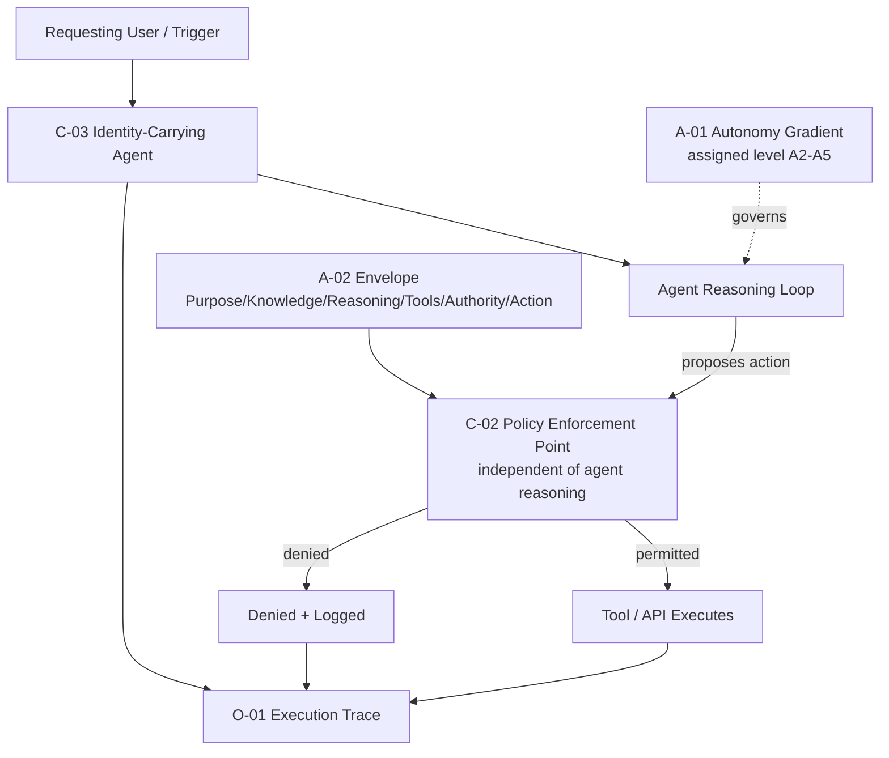

# RA-03 — Bounded Autonomous Agent

## Scenario

An organization wants an AI capability to take multi-step action autonomously — beyond answering questions, actually doing something: updating records, sending communications, orchestrating a multi-system workflow. This is the highest-risk common scenario in AI-native architecture, and this reference architecture is the composition of every control-domain pattern needed to make autonomous action defensible.

## When This Architecture Fits

- Any capability where the `A-01` assessment concludes autonomy level A2 or above is appropriate — the agent will take multiple steps, call tools, and make intermediate decisions.
- Situations where the cost of an uncontrolled agent action (financial, reputational, regulatory) is high enough to justify the engineering investment this architecture requires.

## When It Doesn't Fit

- Single-step, non-agentic AI interactions — see `AP-01` (Agent by Default) for the anti-pattern of applying this architecture's overhead where it is not warranted.
- Capabilities that, on honest assessment, belong at A0/A1 (human decision or recommendation only) — this architecture's autonomous-execution apparatus is unnecessary there.

## Architecture Overview

## Component Breakdown

- **Identity layer** — every action the agent takes is attributed to a specific, verifiable identity (`C-03`), not a shared ambient credential.
- **Autonomy assignment** — the agent's autonomy level is explicitly assigned and justified (`A-01`) before implementation, determining whether per-action human approval or policy-bounded autonomous execution is appropriate.
- **Envelope definition** — the agent's tools, knowledge access, reasoning scope, authority, and action space are explicitly scoped (`A-02`).
- **Enforcement layer** — every proposed action is evaluated against machine-evaluable policy (`C-02`) by a component independent of the agent's own reasoning, before execution.
- **Trace layer** — every action, allowed or denied, along with the identity and policy evaluation involved, is recorded (`O-01`).

## Pattern Composition

| Pattern | Role in This Architecture |
|---|---|
| `A-01` | Determines whether this architecture's full autonomous-execution apparatus is warranted at all, and at what level. |
| `A-02` | Defines the explicit scope the agent operates within, in terms the enforcement layer can evaluate. |
| `C-02` | Provides the actual enforcement mechanism — the reason this architecture is "bounded," not merely "instructed." |
| `C-03` | Makes every action attributable, enabling per-identity authorization and post-hoc accountability. |
| `O-01` | Makes the entire architecture's behavior over time auditable and investigable. |

## Data / Control Flow

1. A request or trigger enters the system under a carried, verified identity (`C-03`).
2. The agent's reasoning loop operates within its assigned autonomy level (`A-01`) and defined Envelope (`A-02`).
3. Every proposed action is routed to a policy enforcement point (`C-02`), architecturally independent of the agent's own reasoning, before execution.
4. Permitted actions execute; denied actions are routed to an explicit denial/escalation path.
5. Every step — proposed action, policy evaluation outcome, executed or denied result — is recorded in the execution trace (`O-01`), linked to the acting identity.

## Integration Points and Seams

- This architecture composes directly with `RA-01` when the agent's steps include knowledge retrieval — retrieval within an agent's reasoning loop should itself be scoped to the carried identity and subject to the same fabric governance.
- Where the agent reaches an autonomy or confidence boundary requiring human involvement, this architecture hands off to `C-01` (Human Authorization Boundary) and `A-03` (Agent Handoff) — not covered in depth here, but the natural next composition.

## Deployment Considerations

- The policy enforcement point must be deployed as a genuinely separate component from the agent's own runtime — co-locating enforcement logic inside the same process as the model's reasoning undermines the independence this architecture depends on.
- Autonomy-level and Envelope definitions should be version-controlled, reviewable artifacts, not configuration values set once and forgotten.

## Security & Governance Considerations

- This architecture is the direct structural corrective for `AP-03` (Prompt-as-Policy) and `AP-06` (Autonomous Privilege Creep) — both anti-patterns describe what results when this architecture's enforcement and identity layers are missing or degraded.
- Policy definitions and Envelope scope should be reviewed on the same recurring cadence as `E-02` (AI Architecture Evolution Loop), not treated as a one-time design decision.

## Known Limitations and Open Trade-offs

- Enforcement granularity is a real engineering trade-off — fine-grained, per-parameter policy evaluation is more secure but more expensive to build and maintain than coarse-grained tool-level gating; this architecture does not prescribe a single correct granularity.
- A well-implemented version of this architecture still depends on the underlying autonomy-level assessment (`A-01`) being honest — no amount of enforcement rigor compensates for an autonomy level assigned without genuine justification.

## Vendor-Neutral Implementation Notes

Policy-as-code engines (OPA/Rego, Cedar, and equivalents) are, as of this framework's August 2026 research pass, an established and actively AI-agent-adapted category for implementing this architecture's `C-02` enforcement layer (see `research/sources.md`). "Agentic identity" — composite, short-lived, delegation-scoped identity specifically for AI agents — is an actively emerging area for the `C-03` layer; implementers should evaluate current tooling specifically against the full propagation-through-execution requirement this architecture depends on, not only the identity-issuance half.

## Related Reference Architectures

`RA-01` (Grounded Enterprise Knowledge Retrieval — composes into this architecture's agent reasoning loop when knowledge lookup is one of the agent's steps), `RA-04` (AI Observability & Evaluation — extends this architecture's `O-01` tracing into full evaluation-gated operations), `RA-05` (Composite Architecture — this reference architecture is the autonomy/control-domain slice of the full composite).

## Revision History

- 0.1.0 (2026-08-24) — Initial reference architecture.
