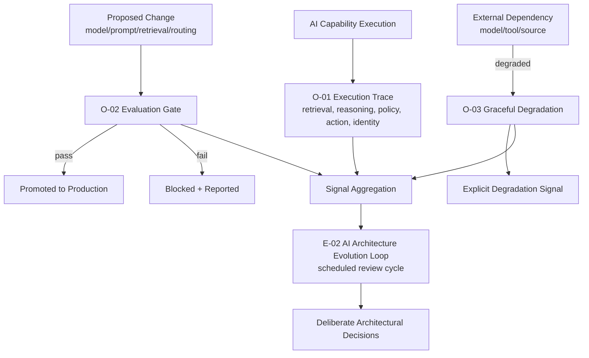

# RA-04 — AI Observability & Evaluation

## Scenario

Any AI-native capability in production needs a defined answer to three operational questions: what happened for a specific execution (observability), is a proposed change safe to ship (evaluation), and what happens when a dependency degrades (resilience). This reference architecture composes the Operations-domain patterns that answer all three, and the Evolution-domain pattern that turns their accumulated signal into deliberate architectural change over time.

## When This Architecture Fits

- Every production AI-native capability, without exception — this is treated as baseline operational infrastructure in this framework, not an optional layer for high-risk capabilities only.

## When It Doesn't Fit

- Purely experimental, pre-production prototypes where the overhead of full trace/evaluation infrastructure would slow iteration disproportionate to the prototype's current risk — though this exemption should be explicit and temporary, with a defined point at which the capability is brought into this architecture before production use.

## Architecture Overview

## Component Breakdown

- **Trace layer** — every execution's retrieval, reasoning, policy evaluation, action, and acting identity is captured under a common execution ID (`O-01`).
- **Evaluation gate** — every proposed change to a capability's model, prompt, retrieval configuration, or routing policy is evaluated against a representative suite before promotion (`O-02`).
- **Degradation layer** — every external dependency has a defined fallback behavior, triggered automatically and always explicitly signaled (`O-03`).
- **Evolution loop** — signal from all three layers above is aggregated on a recurring cycle and turned into deliberate architectural decisions (`E-02`), rather than driving only local, uncoordinated point fixes.

## Pattern Composition

| Pattern | Role in This Architecture |
|---|---|
| `O-01` | The foundational data layer every other component in this architecture, and most other reference architectures, depends on. |
| `O-02` | Prevents unevaluated changes from silently degrading production quality. |
| `O-03` | Bounds the consequence of dependency failure to a known, honestly signaled degradation rather than undefined behavior. |
| `E-02` | Converts accumulated signal from the other three patterns into deliberate architectural change on a recurring cycle. |

## Data / Control Flow

1. Every AI capability execution is traced end-to-end (`O-01`), regardless of outcome.
2. Any proposed change to the capability is evaluated (`O-02`) against a representative suite before it can reach production; the evaluation result is itself linked to the trace of the promotion decision.
3. In production, any dependency degradation triggers a defined fallback (`O-03`), with the degradation explicitly signaled and logged.
4. On a recurring, scheduled cadence — independent of any single incident — signal from traces, evaluation results, and degradation events is aggregated and reviewed (`E-02`), producing deliberate decisions that feed back into the capability's architecture (which may include changes composed from any other reference architecture in this set, e.g., revising an `A-01` autonomy assignment).

## Integration Points and Seams

- This architecture is a required substrate underneath `RA-01`, `RA-02`, and `RA-03` — each of those reference architectures assumes trace data feeds into this one rather than maintaining separate, disconnected observability.
- `A-03` (Agent Handoff) and `C-01` (Human Authorization Boundary) decisions, when present in a composed architecture, should be captured as trace events here as well, even though those patterns are not primary components of this reference architecture.

## Deployment Considerations

- Trace storage and evaluation-suite execution both have real infrastructure cost at scale; this architecture should be sized to the capability's actual production volume, not deployed uniformly at maximum fidelity for every capability regardless of risk tier.
- The evolution loop's (`E-02`) review cadence needs to be a genuine organizational commitment, not just a configured schedule — see `E-02`'s Trade-offs section on the risk of a review cycle that never actually changes anything.

## Security & Governance Considerations

- Trace data is frequently as sensitive as the underlying knowledge and actions it describes, and must be governed accordingly (see `O-01`'s Security Considerations).
- Evaluation thresholds should not be modifiable by the same process responsible for the change being evaluated, preserving the gate's integrity.

## Known Limitations and Open Trade-offs

- A fully instrumented version of this architecture is nontrivial infrastructure investment; organizations should expect to build toward it incrementally rather than requiring it complete before any capability reaches production, provided the gap is explicit and time-bounded rather than indefinite.
- This architecture measures and gates quality — it does not, by itself, guarantee good judgment in how evaluation thresholds or degradation fallbacks are set; those remain human design decisions this architecture makes visible and auditable, not automatic.

## Vendor-Neutral Implementation Notes

AI-specific execution tracing (`O-01`) and CI/CD-integrated evaluation gating (`O-02`) are both, as of this framework's August 2026 research pass, mature and increasingly standard production practice, with a well-established commercial and open-source tooling category (LangSmith, Langfuse, Arize, Braintrust, and others — see `research/sources.md`). Organizations adopting this reference architecture can reasonably build on existing tooling for the `O-01`/`O-02` layers rather than building from scratch; `O-03`'s explicit degradation-signaling requirement is the component most likely to require custom implementation on top of existing resilience/circuit-breaker infrastructure.

## Related Reference Architectures

`RA-03` (Bounded Autonomous Agent — this architecture's `O-01` component is the same trace layer RA-03 depends on), `RA-05` (Composite Architecture — this reference architecture is the operations/evolution-domain slice of the full composite, and the substrate underneath every other slice).

## Revision History

- 0.1.0 (2026-08-24) — Initial reference architecture.
